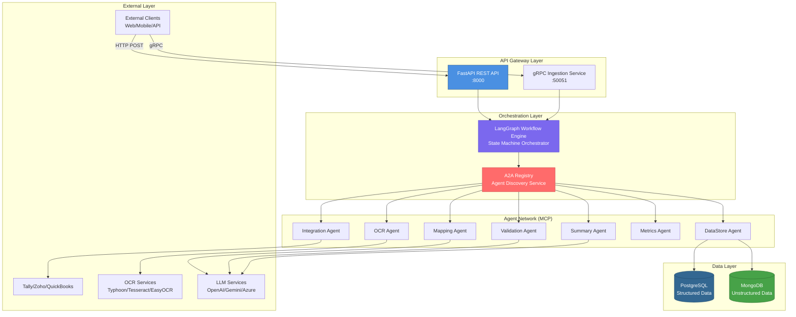
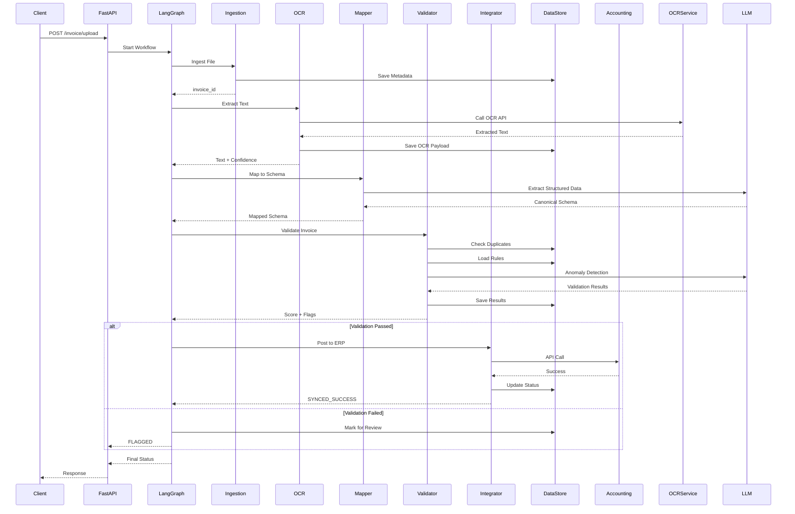
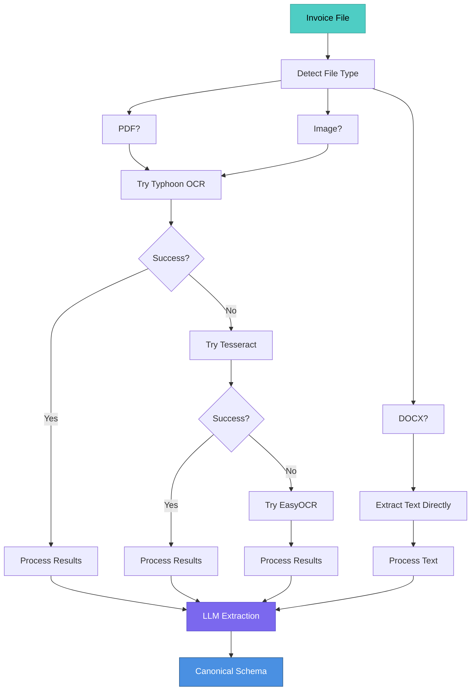
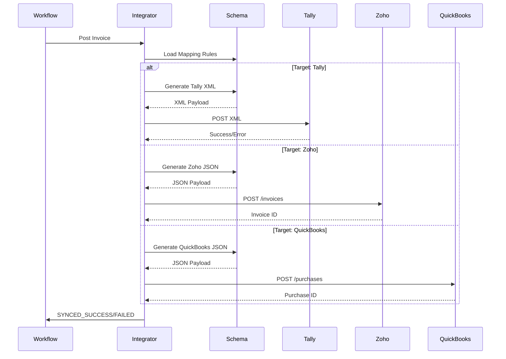
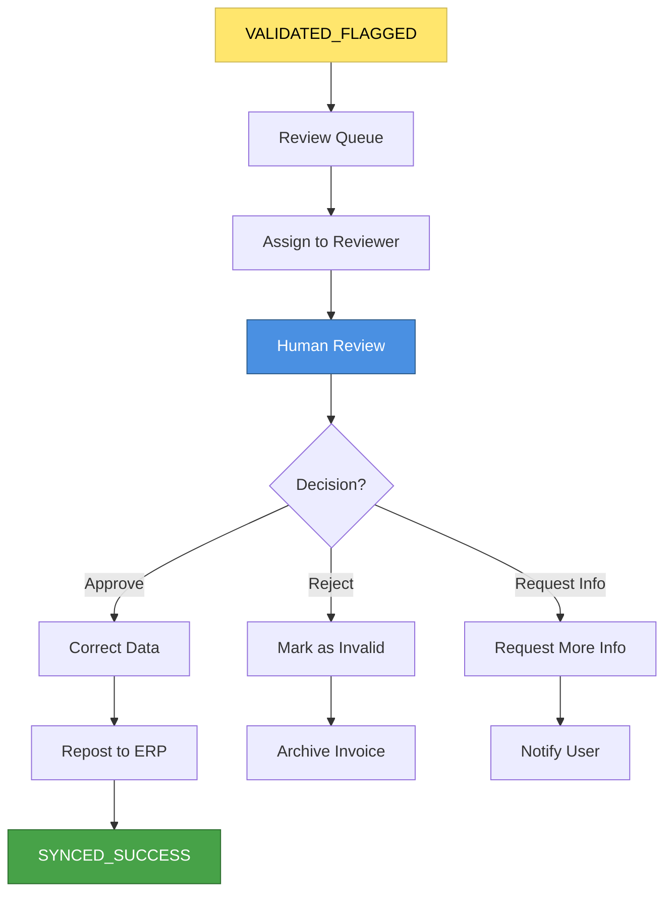
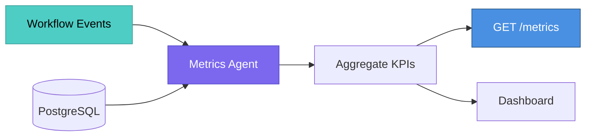

# High-Level System Documentation

## 1. Purpose of This Document

This document provides a comprehensive overview of the **Invoice Automation System** architecture, workflows, and key responsibilities. It serves as the **source of truth** for system-level decisions and helps:

- **New developers** understand the system without diving into code
- **Architects** make informed decisions about system design
- **Integrators** understand how to connect with the system
- **Stakeholders** understand system capabilities and boundaries

This document focuses on **what** the system does and **how** components interact, not implementation details. For implementation-specific information, refer to individual microservice READMEs.

---

## 2. System Overview

### 2.1 What the System Does

The **Invoice Automation System** is a multi-agent, AI-powered platform that automates the complete invoice processing lifecycle:

1. **Ingestion**: Accepts invoice files in various formats (PDF, DOCX, images)
2. **OCR Extraction**: Extracts text and structured data using cascading OCR pipelines
3. **Schema Mapping**: Transforms extracted data into a canonical invoice schema using LLMs
4. **Validation**: Applies business rules to detect anomalies, duplicates, and data quality issues
5. **Integration**: Posts validated invoices to accounting systems (Tally, Zoho Books, QuickBooks)
6. **Reporting**: Provides metrics, summaries, and audit trails

### 2.2 Key Business Goals

- **Automation**: Reduce manual data entry by 90%+
- **Reliability**: Achieve 95%+ accuracy in invoice data extraction
- **Anomaly Detection**: Automatically flag suspicious invoices for human review
- **Speed**: Process invoices in under 2 minutes from upload to posting
- **Auditability**: Maintain complete audit trails for compliance

### 2.3 Primary User Personas

1. **Accounting Team**: Upload invoices, review flagged items, approve postings
2. **System Administrators**: Configure validation rules, manage integrations, monitor system health
3. **Reviewers**: Manually review flagged invoices, correct errors, approve exceptions
4. **Integrators**: External systems that submit invoices via API

### 2.4 Domain Boundaries

The system operates within the following domain boundaries:

- **Invoice Domain**: Owns invoice lifecycle from upload to posting
- **Vendor/Customer Domain**: Manages vendor and customer master data
- **Validation Domain**: Owns validation rules and anomaly detection logic
- **Integration Domain**: Manages connections to external accounting systems
- **Reporting Domain**: Provides metrics and analytics

**Explicitly Out of Scope:**
- User authentication and authorization (handled by external identity provider)
- Payment processing
- Email notifications (handled by external notification service)
- Accounting system credential management (assumes credentials are provided)

---

## 3. High-Level Architecture

### 3.1 System Architecture Diagram



### 3.2 Communication Patterns

**Synchronous APIs:**
- **REST API** (FastAPI): Primary interface for invoice uploads, metrics, summaries
- **gRPC**: High-performance ingestion service for bulk uploads

**Asynchronous Communication:**
- **Agent-to-Agent (A2A) Protocol**: Service discovery and agent registration
- **Model Context Protocol (MCP)**: Standardized tool invocation between agents
- **LangGraph State Machine**: Orchestrates workflow steps with state persistence

**Event Flow:**
- Workflow state transitions are logged to `workflow_audit` table
- Agents communicate via MCP tool calls (synchronous within workflow)
- Future: Event-driven architecture with message queues for scalability

### 3.3 Storage Layers

**PostgreSQL** (Structured Data):
- Invoice records (normalized)
- Vendor and customer master data
- Validation rules and results
- Workflow audit logs
- Agent registry

**MongoDB** (Unstructured Data):
- Invoice metadata (file paths, upload info)
- OCR payloads (raw extracted text)
- Processing logs
- Temporary workflow state

### 3.4 External Integrations

**Accounting Systems:**
- **Tally**: XML-based integration
- **Zoho Books**: REST API integration
- **QuickBooks**: REST API integration

**OCR Services:**
- **Typhoon OCR API**: Primary OCR service
- **Tesseract**: Local fallback
- **EasyOCR**: Secondary fallback
- **Azure Document Intelligence**: Optional premium OCR

**LLM Services:**
- **OpenAI GPT-4**: Schema mapping and validation
- **GPT-4 Vision**: Image-based extraction
- **Google Gemini**: Alternative LLM provider
- **Azure Document Intelligence**: Document understanding

### 3.5 Identity & Authentication Layer

**Current State:**
- No authentication implemented (development phase)
- All endpoints are publicly accessible

**Future Plans:**
- **JWT Bearer Tokens**: For user authentication
- **API Keys**: For service-to-service communication
- **mTLS**: For gRPC services
- **OAuth2**: For third-party integrations

---

## 4. Microservice Responsibilities

### 4.1 InvoiceCoreProcessor (Main Service)

#### 4.1.1 Purpose
Orchestrates the complete invoice processing pipeline from file upload to accounting system integration.

#### 4.1.2 Responsibilities

**Owns:**
- Invoice processing workflow orchestration
- Agent discovery and coordination
- Workflow state management
- API endpoints for invoice operations
- Metrics collection and reporting

**Does NOT Own:**
- User authentication/authorization
- Email notifications
- Payment processing
- Accounting system credentials

#### 4.1.3 Inputs & Outputs

**Incoming APIs:**
- `POST /invoice/upload`: Upload invoice file
- `GET /metrics`: Retrieve processing metrics
- `POST /invoice/summary`: Generate invoice summary
- `gRPC IngestFile`: Bulk ingestion endpoint

**Outgoing Calls:**
- A2A Registry: Agent discovery
- MCP Agents: Tool invocations
- External OCR services (via OCR Agent)
- External LLM services (via Mapping/Validation Agents)

**Consumed Events:**
- None currently (synchronous workflow)

**Produced Events:**
- Workflow state transitions (logged to `workflow_audit`)

#### 4.1.4 Dependencies

**Internal:**
- All MCP agents (OCR, Mapping, Validation, Integration, DataStore, Metrics, Summary)
- A2A Registry service

**External:**
- PostgreSQL (via DataStore Agent)
- MongoDB (via DataStore Agent)
- OCR services (via OCR Agent)
- LLM services (via Mapping/Validation Agents)
- Accounting systems (via Integration Agent)

#### 4.1.5 Data Ownership

**PostgreSQL Tables:**
- `workflow_audit`: Workflow state transitions
- `agent_registry`: Agent registration (shared with A2A)

**MongoDB Collections:**
- None directly (accessed via DataStore Agent)

### 4.2 OCR Agent

#### 4.2.1 Purpose
Extracts text and structured data from invoice files using a cascading OCR pipeline.

#### 4.2.2 Responsibilities

**Owns:**
- OCR pipeline orchestration
- File type detection
- Cascading fallback logic (Typhoon → Tesseract → EasyOCR)
- OCR confidence scoring

**Does NOT Own:**
- File storage (handled by Ingestion Service)
- OCR payload persistence (handled by DataStore Agent)

#### 4.2.3 Inputs & Outputs

**MCP Tool:**
- `ocr/extract_text_cascading`: Extracts text from invoice file

**Output:**
- Extracted text per page
- Average confidence score
- OCR metadata (method used, processing time)

#### 4.2.4 Dependencies

**External:**
- Typhoon OCR API
- Tesseract (local)
- EasyOCR (local)
- Azure Document Intelligence (optional)

### 4.3 Mapping Agent

#### 4.3.1 Purpose
Transforms extracted OCR text into a canonical invoice schema using LLM-based extraction.

#### 4.3.2 Responsibilities

**Owns:**
- Schema mapping logic
- LLM prompt engineering
- Canonical schema definition
- Target system schema transformations

**Does NOT Own:**
- Validation rules
- Accounting system integrations

#### 4.3.3 Inputs & Outputs

**MCP Tool:**
- `map/execute`: Maps extracted text to canonical schema

**Input:**
- Extracted text from OCR
- Target accounting system (Tally/Zoho/QuickBooks)

**Output:**
- Canonical invoice schema (JSON)
- Mapping confidence score

#### 4.3.4 Dependencies

**External:**
- OpenAI GPT-4 (primary)
- Google Gemini (fallback)
- Azure Document Intelligence (optional)

### 4.4 Validation Agent

#### 4.4.1 Purpose
Validates invoice data against business rules and detects anomalies.

#### 4.4.2 Responsibilities

**Owns:**
- Validation rule execution
- Anomaly detection logic
- Reliability score calculation
- Duplicate detection

**Does NOT Own:**
- Validation rule definition (stored in database, managed by admins)
- Invoice data storage

#### 4.4.3 Inputs & Outputs

**MCP Tool:**
- `validate/run_checks`: Validates invoice against rules

**Input:**
- Canonical invoice schema
- OCR confidence score
- Invoice ID

**Output:**
- Validation results (PASS/FAIL/WARN per rule)
- Overall reliability score (0-100)
- Anomaly flags
- Deduction points

#### 4.4.4 Dependencies

**Internal:**
- PostgreSQL: Validation rules, invoice data for duplicate checks

**External:**
- LLM services (for advanced anomaly detection)

### 4.5 Integration Agent

#### 4.5.1 Purpose
Generates ERP-ready payloads and posts invoices to accounting systems.

#### 4.5.2 Responsibilities

**Owns:**
- Accounting system payload generation
- Integration API calls
- Posting status tracking

**Does NOT Own:**
- Accounting system credentials (assumed to be provided)
- Invoice data (reads from canonical schema)

#### 4.5.3 Inputs & Outputs

**MCP Tool:**
- `sync/push_to_erp`: Posts invoice to accounting system

**Input:**
- Canonical invoice schema
- Target system (Tally/Zoho/QuickBooks)
- Reliability score

**Output:**
- Posting status (SUCCESS/FAILED)
- External invoice ID (if applicable)
- Error messages (if failed)

#### 4.5.4 Dependencies

**External:**
- Tally API/XML interface
- Zoho Books REST API
- QuickBooks REST API

### 4.6 DataStore Agent

#### 4.6.1 Purpose
Provides secure, transactional access to PostgreSQL and MongoDB.

#### 4.6.2 Responsibilities

**Owns:**
- Database connection management
- Transaction handling
- Data persistence operations
- Query optimization

**Does NOT Own:**
- Business logic (agents provide logic, DataStore executes)

#### 4.6.3 Inputs & Outputs

**MCP Tools:**
- `postgres/save_validated_record`: Save invoice to PostgreSQL
- `postgres/check_duplicate`: Check for duplicate invoices
- `postgres/save_audit_step`: Log workflow state transition
- `postgres/update_processing_time`: Update processing metrics
- `mongo/save_metadata`: Save invoice metadata to MongoDB
- `mongo/save_ocr_payload`: Save OCR results to MongoDB

#### 4.6.4 Dependencies

**External:**
- PostgreSQL database
- MongoDB database

### 4.7 Metrics Agent

#### 4.7.1 Purpose
Collects and aggregates processing metrics and KPIs.

#### 4.7.2 Responsibilities

**Owns:**
- Metrics calculation
- KPI aggregation
- Performance tracking

**Does NOT Own:**
- Raw invoice data (reads from DataStore)

#### 4.7.3 Inputs & Outputs

**MCP Tool:**
- `metrics/get_all`: Retrieve all metrics

**Output:**
- Total invoices processed
- Average processing time
- Error rates by step
- Validation pass rates
- Integration success rates

### 4.8 Summary Agent

#### 4.8.1 Purpose
Generates human-readable summaries of invoice processing results.

#### 4.8.2 Responsibilities

**Owns:**
- Summary generation logic
- LLM prompt engineering for summaries

**Does NOT Own:**
- Invoice data (reads from workflow state)

#### 4.8.3 Inputs & Outputs

**MCP Tool:**
- `summary/generate`: Generate processing summary

**Input:**
- Invoice data
- Validation results
- Integration status

**Output:**
- Human-readable summary text
- Key highlights
- Action items (if any)

---

## 5. Key Workflows

### 5.1 Invoice Upload & Processing Workflow

**Sequence Diagram:**



**Steps Explained:**

1. **Ingestion**: File is uploaded, metadata stored in MongoDB, invoice ID generated
2. **OCR**: Cascading OCR pipeline extracts text (Typhoon → Tesseract → EasyOCR)
3. **Mapping**: LLM extracts structured data into canonical schema
4. **Validation**: Business rules applied, duplicates checked, anomalies detected
5. **Integration**: If validation passes, invoice posted to accounting system
6. **Summary**: Processing summary generated and returned

**Error Handling:**
- Each step can fail and transition to error handler
- Failed invoices are logged with error details
- Retry logic: Manual retry via API (automatic retries planned for future)

**Idempotency:**
- Duplicate detection based on (vendor_name, invoice_number, invoice_date)
- Same invoice uploaded twice results in update, not duplicate record

### 5.2 OCR + LLM Extraction Workflow

**Detailed Flow:**



**Cascading Logic:**
1. **Primary**: Typhoon OCR API (highest accuracy)
2. **Fallback 1**: Tesseract (local, free)
3. **Fallback 2**: EasyOCR (local, supports multiple languages)

**LLM Extraction:**
- Uses GPT-4 or Gemini to extract structured fields
- Handles variations in invoice formats
- Returns canonical schema with confidence scores

### 5.3 Validation & Anomaly Detection Workflow

**Validation Process:**

```mermaid
flowchart LR
    Start[Canonical Schema] --> Rules[Load Validation Rules]
    Rules --> Duplicate[Check Duplicates]
    Duplicate --> Rule1[Rule 1: Amount Validation]
    Rule1 --> Rule2[Rule 2: Date Validation]
    Rule2 --> Rule3[Rule 3: Tax Calculation]
    Rule3 --> RuleN[Rule N: Custom Rules]
    RuleN --> LLM[LLM Anomaly Detection]
    LLM --> Score[Calculate Reliability Score]
    Score --> Decision{Score >= 80?}
    Decision -->|Yes| Clean[VALIDATED_CLEAN]
    Decision -->|No| Flagged[VALIDATED_FLAGGED]
    
    style Start fill:#4ECDC4,stroke:#3BA39C,color:#000
    style Score fill:#FFE66D,stroke:#CCB857,color:#000
    style Clean fill:#47A248,stroke:#2D6E2F,color:#fff
    style Flagged fill:#FF6B6B,stroke:#CC5555,color:#fff
```



**Validation Rules:**
- **Rule Categories**: Amount, Date, Tax, Vendor, Duplicate, Custom
- **Severity Levels**: 1-5 (1 = info, 5 = critical)
- **Scoring**: Each failed rule deducts points from 100
- **Threshold**: Score < 80 triggers human review

**Anomaly Detection:**
- LLM analyzes invoice for unusual patterns
- Detects: suspicious amounts, date inconsistencies, vendor mismatches
- Flags for manual review

### 5.4 Posting to Accounting Systems Workflow

**Integration Flow:**



**Payload Generation:**
- Each accounting system has a mapping configuration
- Canonical schema is transformed to target format
- Validation ensures required fields are present

**Error Handling:**
- API errors are logged with full details
- Failed postings are marked for retry
- Manual intervention required for persistent failures

### 5.5 Human Review & Approval Loop

**Review Workflow (Future):**



**Current State:**
- Flagged invoices are logged but require manual intervention
- Future: Web UI for reviewers to approve/correct invoices

### 5.6 Reporting and Analytics Pipeline

**Metrics Collection:**



**Key Metrics:**
- Total invoices processed
- Processing time (p50, p95, p99)
- Error rates by step
- Validation pass rate
- Integration success rate
- OCR confidence distribution

---

## 6. Error Handling & Failure Modes

### 6.1 Retry Patterns

**Current Implementation:**
- **Manual Retry**: Failed invoices can be re-uploaded
- **No Automatic Retries**: Each workflow step fails fast

**Future Enhancements:**
- **Exponential Backoff**: For transient failures (OCR API, LLM API)
- **Dead-Letter Queue**: For permanently failed invoices
- **Circuit Breakers**: For external service failures

**Retry Strategy (Planned):**
```
Attempt 1: Immediate
Attempt 2: After 5 seconds
Attempt 3: After 15 seconds
Attempt 4: After 45 seconds
Max Attempts: 4
```

### 6.2 Circuit Breakers

**Planned Implementation:**
- Monitor external service health (OCR, LLM, Accounting APIs)
- Open circuit after 5 consecutive failures
- Half-open after 60 seconds
- Fallback to alternative service when circuit is open

### 6.3 Fallback Paths

**OCR Fallback:**
1. Typhoon OCR (primary)
2. Tesseract (fallback 1)
3. EasyOCR (fallback 2)
4. Manual entry (if all fail)

**LLM Fallback:**
1. OpenAI GPT-4 (primary)
2. Google Gemini (fallback)
3. Rule-based extraction (if LLM unavailable)

**Integration Fallback:**
- No automatic fallback
- Manual retry required
- Alternative accounting system can be selected

### 6.4 Consistency Model

**Current Model:**
- **Eventual Consistency**: Workflow state is eventually consistent
- **Strong Consistency**: Database writes are transactional
- **No Distributed Transactions**: Each agent operation is independent

**Transaction Boundaries:**
- **PostgreSQL**: ACID transactions for invoice data
- **MongoDB**: Document-level consistency
- **Workflow State**: Stored in LangGraph state (in-memory, persisted to audit log)

### 6.5 Idempotency Rules

**Duplicate Detection:**
- **Key**: (vendor_name, invoice_number, invoice_date)
- **Behavior**: Same invoice uploaded twice results in update, not duplicate
- **Implementation**: `UNIQUE` constraint in PostgreSQL

**Workflow Idempotency:**
- Each workflow execution has a unique `invoice_id`
- Re-running workflow with same `invoice_id` updates existing record
- State transitions are append-only (audit log)

**API Idempotency:**
- `POST /invoice/upload`: Not idempotent (creates new invoice each time)
- Future: Add idempotency key header for retry safety

---

## 7. Data Model Overview

### 7.1 Canonical Invoice Model

**Core Fields:**
```json
{
  "invoice_id": "uuid",
  "user_id": "string",
  "vendor": {
    "name": "string",
    "gstin": "string",
    "pan": "string",
    "address": "string"
  },
  "customer": {
    "name": "string",
    "gstin": "string",
    "address": "string"
  },
  "invoice_number": "string",
  "invoice_date": "date",
  "due_date": "date",
  "line_items": [
    {
      "description": "string",
      "quantity": "decimal",
      "unit_price": "decimal",
      "tax_percent": "decimal",
      "amount": "decimal",
      "hsn": "string"
    }
  ],
  "totals": {
    "subtotal": "decimal",
    "gst_amount": "decimal",
    "total_amount": "decimal",
    "round_off": "decimal",
    "grand_total": "decimal"
  },
  "payment": {
    "mode": "string",
    "reference": "string",
    "status": "string"
  }
}
```

### 7.2 Vendor/Customer Model

**Vendor:**
- `id` (UUID)
- `name` (unique with GSTIN)
- `gstin`, `pan`, `address`
- `created_at`, `updated_at`

**Customer:**
- `id` (UUID)
- `name`
- `gstin`, `address`
- `created_at`, `updated_at`

### 7.3 Validation Flags & Confidence Metadata

**Validation Result:**
```json
{
  "validation_run_id": "uuid",
  "invoice_id": "uuid",
  "overall_score": 85.5,
  "status": "VALIDATED_CLEAN" | "VALIDATED_FLAGGED",
  "results": [
    {
      "rule_id": "RULE_001",
      "category": "AMOUNT",
      "status": "PASS" | "FAIL" | "WARN",
      "message": "string",
      "severity": 1-5,
      "deduction_points": 5.0
    }
  ]
}
```

**Confidence Scores:**
- `ocr_confidence`: 0.0-1.0 (average across pages)
- `mapping_confidence`: 0.0-1.0 (LLM extraction confidence)
- `reliability_score`: 0-100 (validation score)

### 7.4 Audit Logs

**Workflow Audit:**
- `invoice_id`: UUID
- `from_status`: Previous state
- `to_status`: New state
- `timestamp`: When transition occurred
- `meta`: JSON metadata (error details, agent info, etc.)

### 7.5 Event Schemas

**Workflow State Transition Event (Future):**
```json
{
  "event_type": "workflow.state_transition",
  "invoice_id": "uuid",
  "from_status": "OCR_DONE",
  "to_status": "MAPPED",
  "timestamp": "2024-01-01T12:00:00Z",
  "correlation_id": "uuid",
  "metadata": {}
}
```

**Invoice Processed Event (Future):**
```json
{
  "event_type": "invoice.processed",
  "invoice_id": "uuid",
  "user_id": "string",
  "status": "SYNCED_SUCCESS",
  "processing_time_ms": 120000,
  "reliability_score": 95.5,
  "timestamp": "2024-01-01T12:00:00Z"
}
```

---

## 8. Security Model

### 8.1 Authentication

**Current State:**
- No authentication implemented
- All endpoints publicly accessible

**Future Plans:**
- **JWT Bearer Tokens**: For user authentication
  - Issued by external identity provider
  - Validated on each API request
  - Token expiration: 1 hour
- **API Keys**: For service-to-service communication
  - Stored in environment variables
  - Rotated quarterly
- **mTLS**: For gRPC services
  - Mutual TLS for service authentication
  - Certificate-based trust

### 8.2 Authorization

**Authorization Model (Planned):**
- **Role-Based Access Control (RBAC)**
  - `admin`: Full system access
  - `accountant`: Upload and review invoices
  - `reviewer`: Review flagged invoices only
  - `service`: Service-to-service communication
- **Resource-Level Authorization**
  - Users can only access their own invoices
  - Admins can access all invoices

### 8.3 Secret Management

**Current:**
- Secrets stored in `.env` file (local development)
- Never committed to version control

**Production:**
- **AWS Secrets Manager** or **HashiCorp Vault**
- Secrets rotated automatically
- Least-privilege access policies

**Secrets Stored:**
- Database credentials
- API keys (OpenAI, Typhoon OCR, etc.)
- Accounting system credentials
- JWT signing keys

### 8.4 Encryption

**At Rest:**
- Database encryption enabled (PostgreSQL, MongoDB)
- File storage encryption (if using cloud storage)

**In Transit:**
- HTTPS/TLS for all API communication
- mTLS for gRPC services
- Encrypted database connections

### 8.5 PII/Financial Data Handling

**Data Classification:**
- **PII**: User IDs, vendor/customer names, addresses
- **Financial**: Invoice amounts, tax information, payment details
- **Sensitive**: GSTIN, PAN numbers

**Handling Rules:**
- PII encrypted at rest
- Financial data logged with redaction (last 4 digits only)
- Audit logs immutable
- Data retention: 7 years (compliance requirement)

### 8.6 Logging/Redaction Guidelines

**Redaction Rules:**
- Credit card numbers: Full redaction
- Bank account numbers: Last 4 digits only
- GSTIN/PAN: Partial redaction (first 2, last 4)
- Email addresses: Domain only in logs

**Log Levels:**
- `INFO`: General operations (no PII)
- `DEBUG`: Detailed diagnostics (PII redacted)
- `ERROR`: Error details (PII redacted)

---

## 9. Observability

### 9.1 Logging

**Log Format:**
- **Structure**: JSON (production), Plaintext (development)
- **Fields**: timestamp, level, service, message, correlation_id, metadata
- **Correlation IDs**: Unique per workflow execution

**Example Log Entry:**
```json
{
  "timestamp": "2024-01-01T12:00:00Z",
  "level": "INFO",
  "service": "InvoiceCoreProcessor",
  "correlation_id": "abc-123-def",
  "message": "Invoice processing started",
  "invoice_id": "uuid",
  "user_id": "user-123"
}
```

**Log Locations:**
- **Local**: `app.log`, `error.log` in project root
- **Production**: Centralized logging (CloudWatch, ELK stack, Datadog)

### 9.2 Metrics

**Key Metrics:**

**Throughput:**
- Invoices processed per minute
- API requests per second
- OCR operations per minute

**Error Rates:**
- Error rate by step (ingestion, OCR, mapping, validation, integration)
- 5xx error rate
- Timeout rate

**Processing Time:**
- End-to-end processing time (p50, p95, p99)
- Step-level processing time
- OCR extraction time
- LLM extraction time

**Queue Lag:**
- Workflow queue depth (future)
- Processing backlog

**Business Metrics:**
- OCR confidence distribution
- Validation pass rate
- Integration success rate
- Duplicate detection rate

**Metrics Endpoint:**
- `GET /metrics`: Returns all metrics as JSON
- Future: Prometheus-compatible `/metrics` endpoint

### 9.3 Distributed Tracing

**Current State:**
- No distributed tracing implemented
- Correlation IDs used for log correlation

**Future Plans:**
- **OpenTelemetry**: Instrument all services
- **Jaeger/Zipkin**: Trace visualization
- **Span Naming**: `service.operation.resource` (e.g., `ocr.extract.invoice`)
- **Trace Propagation**: W3C Trace Context headers

### 9.4 Dashboards

**Planned Dashboards:**
- **System Health**: Service status, error rates, latency
- **Processing Pipeline**: Throughput, step success rates, bottlenecks
- **Business Metrics**: Validation pass rate, integration success rate
- **Cost Tracking**: API usage (OCR, LLM), processing costs

**Tools:**
- Grafana (planned)
- CloudWatch Dashboards (if on AWS)
- Custom dashboards via `/metrics` endpoint

---

## 10. Deployment & Environments

### 10.1 CI/CD Flow

**Current State:**
- Manual deployment
- No CI/CD pipeline configured

**Planned Pipeline:**
```
1. Code Push → GitHub/GitLab
2. Automated Tests (unit, integration)
3. Build Docker Image
4. Deploy to Dev Environment
5. Integration Tests
6. Deploy to Staging
7. Manual Approval
8. Deploy to Production
```

**Tools:**
- GitHub Actions / GitLab CI
- Docker for containerization
- Kubernetes for orchestration (planned)

### 10.2 Environments

**Development:**
- URL: `http://localhost:8000` (local)
- Purpose: Developer testing
- Database: Local PostgreSQL/MongoDB
- Config: `.env` file

**Staging:**
- URL: `https://staging.invoice-automation.example.com`
- Purpose: Pre-production testing
- Database: Staging instances
- Config: Environment variables

**Production:**
- URL: `https://invoice-automation.example.com`
- Purpose: Live system
- Database: Production instances (high availability)
- Config: Secrets manager

### 10.3 Deployment Architecture

**Current:**
- Monolithic deployment (all services in one process)
- Local development with separate terminal windows

**Future:**
- **Containers**: Docker containers per service
- **Orchestration**: Kubernetes for scaling and management
- **Service Mesh**: Istio for service-to-service communication (planned)

### 10.4 Feature Flags

**Current:**
- Environment-based feature toggles (e.g., `OPENAI_ENABLED`)

**Future:**
- Feature flag service (LaunchDarkly, Unleash)
- Per-user feature flags
- Gradual rollout capabilities

### 10.5 Blue-Green/Canary Policies

**Planned:**
- **Blue-Green Deployment**: Zero-downtime deployments
- **Canary Releases**: Gradual rollout (10% → 50% → 100%)
- **Rollback**: Automatic rollback on error rate increase

### 10.6 Rollback Procedure

**Manual Rollback:**
1. Identify last known good version
2. Revert code changes
3. Rebuild and redeploy
4. Verify service health
5. Rollback database migrations if needed

**Automated Rollback (Planned):**
- Monitor error rates during deployment
- Automatic rollback if error rate > 5%
- Notification to team on rollback

---

## 11. Scalability Strategy

### 11.1 Horizontal Scaling

**Current:**
- Single instance deployment
- No horizontal scaling

**Future:**
- **Stateless Services**: All services are stateless (can scale horizontally)
- **Load Balancing**: Nginx/HAProxy for API gateway
- **Auto-Scaling**: Kubernetes HPA based on CPU/memory

### 11.2 Worker Autoscaling

**Planned:**
- **Queue-Based Scaling**: Scale workers based on workflow queue depth
- **CPU-Based Scaling**: Scale based on CPU utilization
- **Target Metrics**: 
  - Queue depth < 10: Scale down
  - Queue depth > 100: Scale up
  - CPU < 30%: Scale down
  - CPU > 70%: Scale up

### 11.3 Partitioning & Sharding

**Database Sharding (Future):**
- **Shard Key**: `user_id` (users distributed across shards)
- **Sharding Strategy**: Hash-based sharding
- **Cross-Shard Queries**: Minimized (most queries are user-scoped)

**Partitioning:**
- **Time-Based Partitioning**: Invoice tables partitioned by month
- **Archive Strategy**: Old invoices moved to cold storage

### 11.4 Caching Strategy

**Current:**
- No caching implemented

**Planned:**
- **Redis Cache**: 
  - Validation rules (TTL: 1 hour)
  - Vendor/customer master data (TTL: 24 hours)
  - Agent registry (TTL: 5 minutes)
- **Cache Invalidation**: On data updates
- **Cache-Aside Pattern**: Read from cache, fallback to database

### 11.5 Bulk Operations Handling

**Current:**
- Sequential processing (one invoice at a time)

**Future:**
- **Batch Processing**: Process multiple invoices in parallel
- **Rate Limiting**: Respect external API rate limits
- **Bulk Upload API**: Accept ZIP files with multiple invoices
- **Async Processing**: Queue-based processing for large batches

---

## 12. Compliance, Audit & Governance

### 12.1 Audit Trail Strategies

**Immutable Audit Logs:**
- All workflow state transitions logged to `workflow_audit` table
- Timestamps and metadata captured
- Logs cannot be modified or deleted

**Audit Log Fields:**
- `invoice_id`: Which invoice
- `from_status`: Previous state
- `to_status`: New state
- `timestamp`: When it happened
- `meta`: Additional context (user, error details, etc.)

### 12.2 Access Control Policies

**Data Access:**
- Users can only access their own invoices
- Admins have full access
- Service accounts have limited access (read-only metrics)

**API Access:**
- Rate limiting per user (planned)
- IP whitelisting for admin endpoints (planned)
- API key rotation (quarterly)

### 12.3 Data Retention Policies

**Invoice Data:**
- **Active**: 2 years (frequently accessed)
- **Archive**: 5 years (cold storage)
- **Delete**: 7 years (compliance requirement)

**Audit Logs:**
- **Retention**: 7 years (immutable)
- **Storage**: WORM (Write-Once-Read-Many) storage

**Logs:**
- **Application Logs**: 30 days
- **Error Logs**: 90 days
- **Audit Logs**: 7 years

### 12.4 Regulatory Compliance

**GST Compliance (India):**
- GSTIN validation
- Tax calculation accuracy
- Invoice format compliance
- Audit trail maintenance

**SOX Compliance (if applicable):**
- Financial data integrity
- Access controls and audit logs
- Change management processes

**FINOPs Compliance:**
- Cost tracking and allocation
- Resource usage monitoring
- Budget adherence

---

## 13. Glossary

This section defines system-wide domain terms and concepts used throughout the documentation.

### 13.1 Core Domain Terms

**Invoice**
- A commercial document issued by a vendor to a customer, requesting payment for goods or services provided. Contains structured data including vendor details, line items, totals, tax information, and payment terms.

**Validation Flag**
- A marker indicating that an invoice has failed one or more validation rules. Flags can be of different severities (INFO, WARN, FAIL) and trigger different workflows (auto-approve, review, reject).

**Anomaly Score**
- A numerical value (0-100) representing the overall reliability and quality of an invoice. Calculated by applying validation rules and deducting points for each failure. Scores below 70 typically require human review.

**Reliability Score**
- Synonym for anomaly score. Represents confidence in the accuracy of extracted and validated invoice data.

**Vendor**
- A supplier or service provider who issues invoices. The system maintains a vendor master table with details like name, GSTIN, PAN, and address.

**Customer**
- The entity receiving goods or services and responsible for payment. May be the same as the organization using the system or a third party.

**Canonical Schema**
- The standardized, system-internal representation of invoice data. All invoices are transformed into this schema regardless of source format or target accounting system.

**Target System**
- The destination accounting/ERP system where validated invoices are posted. Supported systems include Tally, Zoho Books, and QuickBooks.

### 13.2 Agent & Architecture Terms

**Agent**
- An autonomous service component that performs a specific function (OCR, validation, mapping, etc.). Agents communicate via the Model Context Protocol (MCP) and are discovered through the A2A registry.

**Agent Registry**
- A service that maintains a catalog of available agents and their capabilities. Agents register themselves on startup, allowing the orchestrator to discover and invoke them dynamically.

**A2A (Agent-to-Agent)**
- The protocol used for agent discovery and high-level orchestration. Agents register with the A2A registry, which enables dynamic service discovery.

**MCP (Model Context Protocol)**
- A standardized protocol for tool invocation between agents. Each agent exposes tools (capabilities) that can be called by other agents or the orchestrator.

**LangGraph**
- The workflow orchestration framework that manages the invoice processing state machine. Defines nodes (processing steps) and edges (transitions) in the workflow.

**Workflow State**
- The current status and data of an invoice as it progresses through the processing pipeline. States include: UPLOADED, OCR_DONE, MAPPED, VALIDATED_CLEAN, VALIDATED_FLAGGED, SYNCED_SUCCESS, etc.

### 13.3 Processing Terms

**Ingestion**
- The process of accepting an invoice file, storing it, and creating initial metadata. Handled by the Ingestion Service (gRPC).

**OCR (Optical Character Recognition)**
- The process of extracting text and structured data from invoice images or PDFs. The system uses a cascading OCR pipeline that tries multiple OCR engines in sequence until one succeeds.

**Cascading OCR**
- A fallback strategy where multiple OCR engines are tried in order of preference (Typhoon OCR → Tesseract → EasyOCR) until one successfully extracts text.

**Schema Mapping**
- The transformation of raw extracted text into a structured, canonical invoice schema. Performed by LLM-based mapping agents that understand invoice semantics.

**Validation Rule**
- A business rule that checks invoice data for correctness, completeness, or anomalies. Rules have categories (math, totals, dates, duplicates) and severity levels (1-5).

**Validation Run**
- A single execution of all validation rules against an invoice. Results are stored with timestamps and version information for audit purposes.

**Integration**
- The process of posting a validated invoice to the target accounting system. Involves transforming the canonical schema into the target system's format (JSON for Zoho, XML for Tally, etc.).

**Posting**
- Synonym for integration. The act of creating a record in the target accounting system.

### 13.4 Data & Storage Terms

**Structured Data**
- Data stored in PostgreSQL with a well-defined schema. Includes invoices, vendors, customers, validation results, and audit logs.

**Unstructured Data**
- Data stored in MongoDB without a fixed schema. Includes OCR payloads, raw extracted text, and metadata.

**Workflow Audit**
- An immutable log of all state transitions for an invoice. Records when and why an invoice moved from one state to another.

**Correlation ID**
- A unique identifier (typically the invoice_id) used to trace a single invoice's journey through the system across all services and logs.

**Idempotency Key**
- A unique identifier that ensures operations can be safely retried without creating duplicates. Used for invoice ingestion and posting.

### 13.5 Technical Terms

**gRPC**
- A high-performance RPC framework used for the Ingestion Service. Provides type-safe, efficient communication between services.

**REST API**
- The HTTP-based API (FastAPI) used for invoice uploads, metrics, and summaries. Follows RESTful principles.

**State Machine**
- A computational model where the system transitions between defined states based on events. The LangGraph workflow implements a state machine for invoice processing.

**Event-Driven**
- An architecture pattern where services communicate via events/messages rather than direct calls. Currently implemented via agent-to-agent communication (future: Kafka/queues).

**Circuit Breaker**
- A pattern that prevents cascading failures by stopping requests to a failing service. Not yet implemented but planned for external service calls.

**Dead Letter Queue (DLQ)**
- A queue for messages that cannot be processed after multiple retries. Planned for async processing.

---

## 14. Appendix

### 14.1 Change History

| Version | Date | Author | Changes |
|---------|------|--------|---------|
| 1.0.0 | 2024 | System Architects | Initial high-level documentation |

### 14.2 Links to Other Documentation

**Service-Specific Documentation:**
- [InvoiceCoreProcessor README](../InvoiceCoreProcessor/README.md) - Detailed microservice documentation
- [API Documentation](../InvoiceCoreProcessor/docs/api.md) - API endpoint specifications
- [Database Schema](../InvoiceCoreProcessor/docs/db_schema.md) - Database schema details
- [Agent Documentation](../InvoiceCoreProcessor/docs/agents.md) - Agent capabilities and tools
- [Architecture Details](../InvoiceCoreProcessor/docs/architecture.md) - Technical architecture deep-dive

**External Resources:**
- [LangGraph Documentation](https://langchain-ai.github.io/langgraph/) - Workflow orchestration framework
- [Model Context Protocol](https://modelcontextprotocol.io/) - MCP specification
- [FastAPI Documentation](https://fastapi.tiangolo.com/) - REST API framework
- [gRPC Documentation](https://grpc.io/) - RPC framework

### 14.3 Architectural Decision Records (ADRs)

**ADR-001: Multi-Agent Architecture**
- **Decision**: Use agent-based architecture with MCP for inter-agent communication
- **Rationale**: Enables modularity, extensibility, and independent scaling of processing components
- **Status**: Implemented
- **Date**: 2024

**ADR-002: LangGraph for Workflow Orchestration**
- **Decision**: Use LangGraph instead of traditional workflow engines
- **Rationale**: Native Python integration, state management, and AI/LLM integration capabilities
- **Status**: Implemented
- **Date**: 2024

**ADR-003: Dual Database Strategy**
- **Decision**: Use PostgreSQL for structured data and MongoDB for unstructured data
- **Rationale**: PostgreSQL provides ACID guarantees for financial data, MongoDB handles flexible schemas for OCR payloads
- **Status**: Implemented
- **Date**: 2024

**ADR-004: Cascading OCR Pipeline**
- **Decision**: Implement fallback OCR strategy (Typhoon → Tesseract → EasyOCR)
- **Rationale**: Maximizes extraction success rate while optimizing for cost and speed
- **Status**: Implemented
- **Date**: 2024

**ADR-005: LLM-Based Schema Mapping**
- **Decision**: Use LLMs (GPT-4, Gemini) for invoice schema mapping instead of rule-based extraction
- **Rationale**: Handles diverse invoice formats and layouts without extensive rule maintenance
- **Status**: Implemented
- **Date**: 2024

**ADR-006: Synchronous Processing (Current)**
- **Decision**: Process invoices synchronously via LangGraph workflow
- **Rationale**: Simpler error handling and immediate feedback
- **Status**: Current implementation
- **Future**: Consider async processing for high-volume scenarios

### 14.4 Postmortems & Incident Reports

*This section will be populated as incidents occur and postmortems are conducted.*

### 14.5 Design Documents

**Invoice Processing Workflow Design:**
- Document: `docs/architecture.md`
- Describes the LangGraph state machine and node implementations

**Agent Communication Protocol:**
- Document: `docs/agents.md`
- Describes MCP tool definitions and agent capabilities

**Database Design:**
- Document: `docs/db_schema.md`
- Describes table structures, relationships, and indexing strategies

### 14.6 System Limits & Known Constraints

**Current Limits:**
- Maximum file size: 50 MB (configurable)
- Maximum concurrent processing: Limited by database connection pool (default: 20)
- Bulk uploads: Processed sequentially (not optimized for >100 invoices)

**Known Constraints:**
- OCR processing time: 5-30 seconds depending on file size and complexity
- LLM mapping: 10-20 seconds per invoice (depends on LLM provider)
- Validation: <1 second per invoice
- Integration posting: 2-5 seconds per invoice (depends on target system)

**Planned Improvements:**
- Async processing for bulk uploads
- Parallel OCR processing
- Caching for repeated vendor/customer lookups
- Batch posting to accounting systems

### 14.7 Contact & Support

**Technical Questions:**
- Architecture: System Architects
- Integration: Integration Team
- Operations: DevOps Team

**Documentation Updates:**
- This document should be updated when:
  - New microservices are added
  - Workflows change significantly
  - Architecture decisions are made
  - New integrations are added

---

**Document Version**: 1.0.0  
**Last Updated**: 2024  
**Maintained By**: System Architecture Team