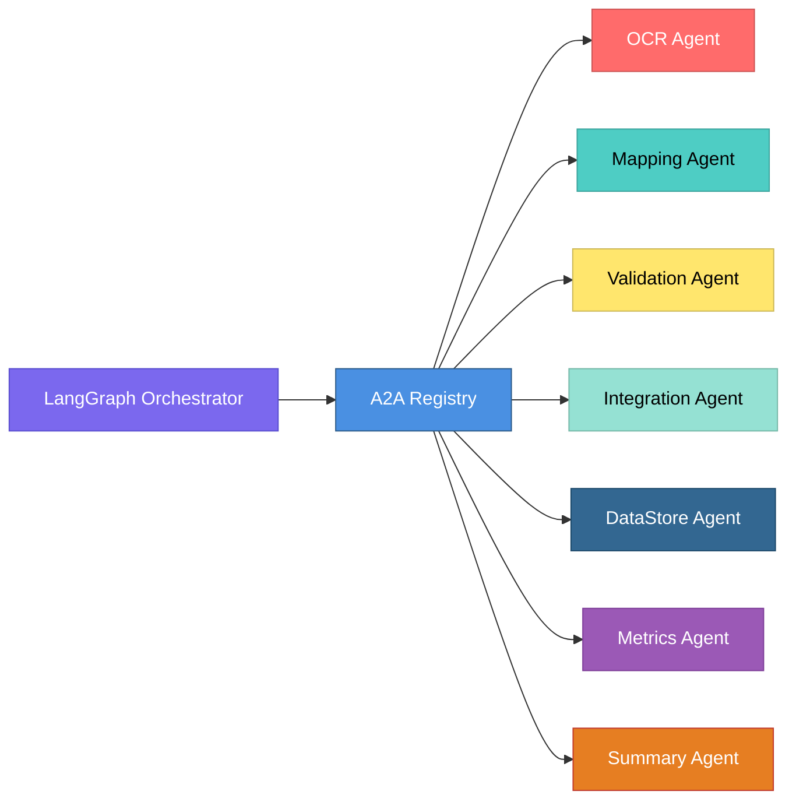

# Agent Documentation

## 1. Overview

The InvoiceCoreProcessor uses a **multi-agent architecture** where specialized agents handle specific tasks in the invoice processing pipeline. Agents communicate via the **Model Context Protocol (MCP)** and are discovered through the **A2A (Agent-to-Agent) Registry**.

### 1.1 Agent Architecture

**Key Concepts:**
- **Agent**: A specialized service component that performs a specific function
- **Tool**: A capability exposed by an agent via MCP
- **Capability**: A high-level function type (e.g., `CAPABILITY_OCR`, `CAPABILITY_VALIDATION`)
- **Agent Card**: Metadata describing an agent's identity and capabilities

**Agent Lifecycle:**
1. Agent starts up
2. Agent creates `AgentCard` with tools
3. Agent registers with A2A Registry
4. Registry stores agent metadata in PostgreSQL
5. Orchestrator discovers agent by capability
6. Orchestrator invokes agent tools via MCP

### 1.2 Agent Network



---

## 2. Agent Catalog

### 2.1 DataStore Agent

**Agent ID:** `com.invoice.datastore`

**Description:**
Provides secure, transactional access to both PostgreSQL and MongoDB databases. Acts as the single point of data persistence for all agents, ensuring data consistency and proper transaction management.

**Capability:** `CAPABILITY_DB_WRITE`

**MCP Tools:**

#### `postgres/save_validated_record`
Saves a validated invoice record to PostgreSQL with normalized structure.

**Parameters:**
```json
{
  "vendor": {
    "name": "Acme Ltd",
    "gstin": "27AAAAA0000A1Z5"
  },
  "invoiceNumber": "INV-1002",
  "invoiceDate": "2025-05-10",
  "lineItems": [
    {
      "description": "Service Fee",
      "quantity": 1.0,
      "unitPrice": 5000.00,
      "taxPercent": 18.0,
      "amount": 5000.00
    }
  ],
  "totals": {
    "grandTotal": 82600.00
  },
  "user_id": "user-123"
}
```

**Response:**
```json
{
  "status": "RECORD_SAVED",
  "invoice_id": "inv-abc123-def456",
  "vendor_id": "vendor-uuid-123"
}
```

**Behavior:**
- Upserts vendor (creates if new, updates if exists)
- Upserts invoice (creates if new, updates if exists)
- Deletes existing line items and inserts new ones
- Returns invoice and vendor IDs

---

#### `postgres/update_processing_time`
Updates processing timestamps and calculates duration.

**Parameters:**
```json
{
  "invoice_id": "inv-abc123-def456"
}
```

**Response:**
```json
{
  "status": "TIME_UPDATED"
}
```

**Behavior:**
- Updates `processing_end_time` to current timestamp
- Calculates `processing_duration_ms` from start and end times
- Updates invoice record

---

#### `postgres/check_duplicate`
Checks if an invoice with the same vendor, number, and date already exists.

**Parameters:**
```json
{
  "vendor_name": "Acme Ltd",
  "invoice_number": "INV-1002",
  "invoice_date": "2025-05-10"
}
```

**Response:**
```json
{
  "is_duplicate": true,
  "existing_invoice_id": "inv-existing-123"
}
```

**Behavior:**
- Queries invoices table with vendor, number, and date
- Returns boolean indicating duplicate status
- Returns existing invoice ID if duplicate found

---

#### `postgres/save_audit_step`
Saves a workflow state transition to the audit log.

**Parameters:**
```json
{
  "invoice_id": "inv-abc123-def456",
  "from_status": "UPLOADED",
  "to_status": "OCR_DONE",
  "meta": {
    "agent_id": "com.invoice.ocr",
    "processing_time_ms": 1250
  }
}
```

**Response:**
```json
{
  "status": "AUDIT_STEP_SAVED"
}
```

**Behavior:**
- Inserts immutable audit record
- Stores metadata as JSONB
- Timestamp automatically set

---

#### `postgres/register_agent`
Registers an agent in the agent registry (used by AgentRegistryService).

**Parameters:**
```json
{
  "agent_id": "com.invoice.ocr",
  "agent_card": {
    "agent_id": "com.invoice.ocr",
    "description": "OCR extraction agent",
    "tools": [...]
  }
}
```

**Response:**
```json
{
  "status": "AGENT_FULLY_REGISTERED",
  "agent_id": "com.invoice.ocr"
}
```

---

#### `postgres/save_tool`
Registers a tool for an agent.

**Parameters:**
```json
{
  "agent_id": "com.invoice.ocr",
  "tool_id": "ocr/extract_text_cascading",
  "capability": "CAPABILITY_OCR",
  "description": "Extract text from invoice files",
  "parameters": {}
}
```

**Response:**
```json
{
  "status": "TOOL_SAVED"
}
```

---

#### `mongo/save_metadata`
Saves invoice ingestion metadata to MongoDB.

**Parameters:**
```json
{
  "invoice_id": "inv-abc123-def456",
  "user_id": "user-123",
  "file_path": "/uploads/invoice.pdf",
  "file_size": 245678,
  "file_type": "pdf",
  "storage_path": "/storage/invoices/inv-abc123.pdf"
}
```

**Response:**
```json
{
  "status": "METADATA_SAVED"
}
```

---

#### `mongo/save_ocr_payload`
Saves raw OCR extraction results to MongoDB.

**Parameters:**
```json
{
  "invoice_id": "inv-abc123-def456",
  "ocr_engine": "typhoon",
  "confidence": 0.95,
  "pages": [
    {
      "page_number": 1,
      "text": "Invoice Number: INV-1002..."
    }
  ],
  "tables": []
}
```

**Response:**
```json
{
  "status": "OCR_PAYLOAD_SAVED"
}
```

---

#### `mongo/log_response`
Logs agent execution details to MongoDB.

**Parameters:**
```json
{
  "invoice_id": "inv-abc123-def456",
  "agent_id": "com.invoice.ocr",
  "tool_id": "ocr/extract_text_cascading",
  "execution_time_ms": 1250,
  "status": "SUCCESS",
  "input": {...},
  "output": {...}
}
```

**Response:**
```json
{
  "status": "LOG_SAVED"
}
```

---

### 2.2 OCR Agent

**Agent ID:** `com.invoice.ocr`

**Description:**
Executes a file-type-aware, cascading OCR pipeline for extracting text and structured data from invoice files. Tries multiple OCR engines in sequence until one succeeds, ensuring high extraction success rates.

**Capability:** `CAPABILITY_OCR`

**MCP Tools:**

#### `ocr/extract_text_cascading`
Extracts structured text and tables from various document types using a cascading OCR pipeline.

**Parameters:**
```json
{
  "invoice_id": "inv-abc123-def456",
  "file_path": "/uploads/invoice.pdf",
  "file_extension": "pdf",
  "user_id": "user-123"
}
```

**Response:**
```json
{
  "status": "OCR_DONE",
  "avg_confidence": 0.95,
  "pages": [
    {
      "page_number": 1,
      "text": "Invoice Number: INV-1002\nDate: 2025-05-10\n..."
    }
  ],
  "tables": [
    {
      "page_number": 1,
      "cells": [
        ["Description", "Quantity", "Price"],
        ["Service Fee", "1", "5000"]
      ]
    }
  ],
  "raw_engine_trace": {
    "engine": "typhoon",
    "attempted_engines": ["typhoon", "gpt_vision", "azure", "tesseract", "easyocr"]
  }
}
```

**Error Response:**
```json
{
  "status": "FAILED_OCR",
  "error": "File not found: /uploads/invoice.pdf",
  "avg_confidence": 0.0,
  "pages": [],
  "tables": [],
  "raw_engine_trace": {
    "final_status": "all engines failed"
  }
}
```

**Supported File Types:**
- `pdf`: Uses `pdfplumber` for direct text extraction
- `docx`: Uses `python-docx` for document parsing
- `png`, `jpg`, `jpeg`, `tiff`: Uses cascading OCR pipeline

**Cascading OCR Pipeline:**
1. **Typhoon OCR** (cloud, high accuracy) - Threshold: 0.8
2. **GPT-4 Vision** (cloud, high accuracy) - Threshold: 0.75
3. **Azure Document Intelligence** (cloud, high accuracy) - Threshold: 0.75
4. **Tesseract** (local, medium accuracy) - Threshold: 0.6
5. **EasyOCR** (local, fallback) - Threshold: 0.0

**Behavior:**
- Tries engines in order of preference
- Stops when confidence threshold is met
- Falls back to next engine on failure
- Returns best result or failure if all engines fail

---

### 2.3 Schema Mapper Agent

**Agent ID:** `com.invoice.mapper`

**Description:**
Uses an LLM (Large Language Model) to map extracted OCR text to a structured, canonical invoice schema. Understands invoice semantics and extracts structured data regardless of invoice format or layout.

**Capability:** `CAPABILITY_MAPPING`

**MCP Tools:**

#### `map/execute`
Takes raw extracted text and maps it to a structured canonical invoice JSON.

**Parameters:**
```json
{
  "extracted_text": "Invoice Number: INV-1002\nDate: 2025-05-10\nVendor: Acme Ltd\n...",
  "target_system": "ZOHO"
}
```

**Response:**
```json
{
  "status": "MAPPING_COMPLETE",
  "mapped_schema": {
    "invoiceNumber": "INV-1002",
    "invoiceDate": "2025-05-10",
    "vendor": {
      "name": "Acme Ltd",
      "gstin": "27AAAAA0000A1Z5",
      "address": "123 Business St, Mumbai"
    },
    "lineItems": [
      {
        "description": "Software Development Services",
        "quantity": 1.0,
        "unitPrice": 50000.00,
        "taxPercent": 18.0,
        "amount": 50000.00,
        "hsn": "998314"
      }
    ],
    "totals": {
      "subtotal": 70000.00,
      "gstAmount": 12600.00,
      "roundOff": 0.00,
      "grandTotal": 82600.00
    }
  }
}
```

**Error Response:**
```json
{
  "status": "FAILED_MAPPING",
  "error": "LLM API timeout"
}
```

**LLM Configuration:**
- Model: `OPENAI_MODEL` (default: `gpt-4`)
- Response format: JSON object
- Temperature: 0.1 (low for consistency)
- Max tokens: Model-dependent

**Behavior:**
- Sends extracted text to LLM with structured prompt
- LLM extracts fields based on canonical schema
- Returns structured JSON matching schema
- Handles various invoice formats and layouts

---

### 2.4 Validation Agent

**Agent ID:** `com.invoice.validation`

**Description:**
Implements comprehensive validation and anomaly detection for invoices. Applies business rules, detects duplicates, checks data integrity, and computes reliability scores.

**Capability:** `CAPABILITY_VALIDATION`

**MCP Tools:**

#### `validate/run_checks`
Runs a series of validation rules and computes a reliability score for a mapped invoice.

**Parameters:**
```json
{
  "mapped_schema": {
    "invoiceNumber": "INV-1002",
    "invoiceDate": "2025-05-10",
    "lineItems": [...],
    "totals": {...}
  },
  "invoice_id": "inv-abc123-def456",
  "ocr_confidence": 0.95
}
```

**Response:**
```json
{
  "status": "VALIDATED_FLAGGED",
  "overall_score": 75.5,
  "validation_results": [
    {
      "rule_id": "LIT-004",
      "status": "PASS",
      "message": "Line item math correct",
      "severity": 1,
      "deduction_points": 0.0
    },
    {
      "rule_id": "TTL-001",
      "status": "FAIL",
      "message": "Subtotal does not match sum of line items",
      "severity": 5,
      "deduction_points": 20.0
    },
    {
      "rule_id": "ANM-004",
      "status": "WARN",
      "message": "Low OCR confidence (0.75)",
      "severity": 3,
      "deduction_points": 2.5
    }
  ]
}
```

**Validation Rules:**

**Line Item Rules:**
- `LIT-004`: Line item math (quantity × unit_price = amount)

**Total Rules:**
- `TTL-001`: Subtotal matches sum of line items
- `TTL-003`: Grand total matches (subtotal + GST + round-off)

**Date Rules:**
- `INV-003`: Invoice date is valid and not in future

**Duplicate Rules:**
- `DUP-001`: Duplicate invoice detection (vendor + number + date)

**Anomaly Rules:**
- `ANM-004`: OCR confidence threshold check

**Reliability Score Calculation:**
- Starts at 100.0
- Deducts points for each failed/warning rule
- Final score: `max(0, 100 - total_deductions)`
- Status: `VALIDATED_CLEAN` if all PASS, else `VALIDATED_FLAGGED`

**Behavior:**
- Loads active validation rules from database
- Executes each rule against mapped schema
- Calculates overall reliability score
- Returns detailed results for each rule

---

### 2.5 Integration Agent

**Agent ID:** `com.invoice.integration`

**Description:**
Takes a validated canonical invoice and generates ERP-ready payloads for posting to accounting systems (Tally, Zoho Books, QuickBooks). Handles system-specific transformations and posting logic.

**Capability:** `CAPABILITY_INTEGRATION`

**MCP Tools:**

#### `sync/push_to_erp`
Generates and posts a payload to a target ERP system.

**Parameters:**
```json
{
  "invoice_id": "inv-abc123-def456",
  "target_system": "ZOHO",
  "mapped_schema": {
    "invoiceNumber": "INV-1002",
    "vendor": {...},
    "lineItems": [...],
    "totals": {...}
  },
  "reliability_score": 95.5
}
```

**Response:**
```json
{
  "status": "SYNCED_SUCCESS",
  "external_id": "zoho-inv-789",
  "idempotency_key": "post-abc123-20250115",
  "posted_at": "2025-01-15T10:01:30Z"
}
```

**Error Response:**
```json
{
  "status": "SYNCED_FAILED",
  "error": "Zoho API authentication failed",
  "error_code": "AUTH_ERROR"
}
```

**Supported Systems:**

**Zoho Books:**
- Format: JSON
- Endpoint: `POST /api/v3/invoices`
- Authentication: OAuth 2.0
- Mapping: Defined in `config/accounting_schemas.py`

**Tally:**
- Format: XML
- Endpoint: Tally Exchange Server
- Authentication: Username/password or certificate
- Mapping: XML envelope structure

**QuickBooks:**
- Format: JSON
- Endpoint: `POST /v3/company/{companyId}/invoice`
- Authentication: OAuth 2.0
- Mapping: QuickBooks API format

**Behavior:**
- Transforms canonical schema to target system format
- Generates idempotency key
- Posts to accounting system API
- Handles authentication and retries
- Returns external system ID on success

---

### 2.6 Metrics Agent

**Agent ID:** `com.invoice.metrics`

**Description:**
Collects and reports on key performance indicators (KPIs) for the invoice processing system. Aggregates metrics from database and provides comprehensive analytics.

**Capability:** `CAPABILITY_METRICS`

**MCP Tools:**

#### `metrics/get_all`
Retrieves a comprehensive set of KPIs.

**Parameters:**
```json
{}
```

**Response:**
```json
{
  "summary": {
    "total_invoices": 532,
    "processed": 532,
    "synced": 491,
    "flagged": 41,
    "failed": 0,
    "total_value": 1849200.55
  },
  "processing_times": {
    "avg_ms": 45000,
    "p50_ms": 42000,
    "p95_ms": 78000,
    "p99_ms": 120000
  },
  "success_rates": {
    "ingestion": 1.0,
    "ocr": 0.98,
    "mapping": 0.97,
    "validation": 0.95,
    "integration": 0.92
  },
  "validation_stats": {
    "avg_reliability_score": 87.5,
    "flags_by_category": {
      "TOTALS": 15,
      "LINE_ITEMS": 8,
      "DUPLICATE": 3,
      "ANOMALY": 12
    }
  },
  "integration_stats": {
    "tally": {"posted": 150, "failed": 5, "success_rate": 0.97},
    "zoho": {"posted": 200, "failed": 8, "success_rate": 0.96},
    "quickbooks": {"posted": 141, "failed": 2, "success_rate": 0.99}
  }
}
```

**Metrics Collected:**
- Total invoices processed
- Processing times (avg, p50, p95, p99)
- Success rates by stage
- Validation statistics
- Integration statistics by system
- Total monetary value processed

**Behavior:**
- Queries PostgreSQL for invoice statistics
- Calculates aggregations and percentiles
- Returns comprehensive metrics object

---

### 2.7 Summary Agent

**Agent ID:** `com.invoice.summary`

**Description:**
Generates a human-readable summary of the invoice validation and integration status using LLM. Provides natural language descriptions of processing results.

**Capability:** `CAPABILITY_SUMMARY`

**MCP Tools:**

#### `summary/generate`
Takes invoice data and generates a summary.

**Parameters:**
```json
{
  "invoice_data": {
    "invoice": {
      "invoiceNumber": "INV-1002",
      "vendor": {"name": "Acme Ltd"},
      "totals": {"grandTotal": 82600.00}
    },
    "validation": {
      "status": "VALIDATED_FLAGGED",
      "overall_score": 75.5,
      "rules": [...]
    },
    "integration": {
      "target_system": "ZOHO",
      "status": "SYNCED_SUCCESS"
    },
    "review": {
      "required": true
    }
  }
}
```

**Response:**
```json
{
  "summary": "Invoice INV-1002 from Acme Ltd dated 2025-05-10 has been processed successfully. The invoice totals ₹82,600.00 and has been posted to Zoho Books. However, the invoice was flagged during validation with a reliability score of 75.5%. A subtotal mismatch was detected, which requires manual review.",
  "highlights": [
    "Invoice successfully posted to Zoho Books",
    "Subtotal validation failed - requires review",
    "Overall reliability score: 75.5%"
  ],
  "recommendations": [
    "Review subtotal calculation",
    "Verify line item amounts"
  ]
}
```

**LLM Configuration:**
- Model: `OPENAI_MODEL` (default: `gpt-4`)
- Temperature: 0.7 (higher for natural language)
- Prompt: Structured prompt from `prompts/summary_prompt.py`

**Behavior:**
- Constructs prompt from invoice data
- Sends to LLM for summary generation
- Returns natural language summary with highlights and recommendations

---

## 3. Agent Communication

### 3.1 MCP Protocol

**Tool Invocation:**
```python
result = mcp_client.call_tool(
    agent_id="com.invoice.ocr",
    tool_id="ocr/extract_text_cascading",
    invoice_id="inv-123",
    file_path="/path/to/invoice.pdf",
    file_extension="pdf",
    user_id="user-456"
)
```

**Error Handling:**
- Tool failures return error status
- Orchestrator handles errors and routes appropriately
- Errors logged with correlation IDs

### 3.2 Agent Discovery

**Capability-Based Lookup:**
```python
agent_id, tool = registry.lookup_agent_by_capability("CAPABILITY_OCR")
# Returns: ("com.invoice.ocr", ToolDefinition(...))
```

**Registration:**
```python
agent_card = AgentCard(
    agent_id="com.invoice.ocr",
    description="OCR extraction agent",
    tools=[...]
)
registry.register_agent(agent_card)
```

---

## 4. Adding New Agents

### 4.1 Agent Development Steps

1. **Create Agent Server:**
   - Create file in `src/invoice_core_processor/servers/`
   - Define `AgentCard` with tools
   - Implement tool functions

2. **Define Tools:**
   - Create `ToolDefinition` for each tool
   - Specify capability type
   - Define parameters schema

3. **Register Agent:**
   - Call `register_agent()` on startup
   - Agent appears in registry
   - Available for discovery

4. **Test Agent:**
   - Write unit tests
   - Test tool invocations
   - Verify registration

### 4.2 Example Agent Template

```python
from invoice_core_processor.core.models import AgentCard, ToolDefinition
from invoice_core_processor.core.agent_registry import AgentRegistryService

AGENT_ID = "com.invoice.example"
CAPABILITY_EXAMPLE = "CAPABILITY_EXAMPLE"

AGENT_CARD = AgentCard(
    agent_id=AGENT_ID,
    description="Example agent description",
    tools=[
        ToolDefinition(
            tool_id="example/do_something",
            capability=CAPABILITY_EXAMPLE,
            description="Does something useful",
            parameters={
                "param1": {"type": "str"},
                "param2": {"type": "int", "optional": True}
            }
        )
    ]
)

def do_something(param1: str, param2: int = 0) -> dict:
    """Tool implementation."""
    # Business logic here
    return {"status": "SUCCESS", "result": "..."}

class ExampleAgentServer:
    def __init__(self):
        self.tools = {
            "example/do_something": do_something,
        }
    
    def register_self(self):
        registry = AgentRegistryService()
        registry.register_agent(AGENT_CARD)
    
    def run(self):
        self.register_self()
        print("ExampleAgent running...")

if __name__ == "__main__":
    server = ExampleAgentServer()
    server.run()
```

---

## 5. Agent Best Practices

### 5.1 Design Principles

**Single Responsibility:**
- Each agent handles one specific function
- Clear boundaries and responsibilities
- Minimal dependencies

**Idempotency:**
- Tools should be idempotent when possible
- Safe to retry on failure
- Use idempotency keys for external calls

**Error Handling:**
- Return structured error responses
- Include error codes and messages
- Log errors with context

### 5.2 Performance

**Efficiency:**
- Minimize database calls
- Cache frequently accessed data
- Use connection pooling

**Scalability:**
- Stateless agents (when possible)
- Horizontal scaling support
- Resource-efficient operations

### 5.3 Observability

**Logging:**
- Log all tool invocations
- Include correlation IDs
- Log execution times

**Metrics:**
- Track tool execution times
- Monitor success/failure rates
- Report agent health

---

**Document Version**: 1.0.0  
**Last Updated**: 2024
