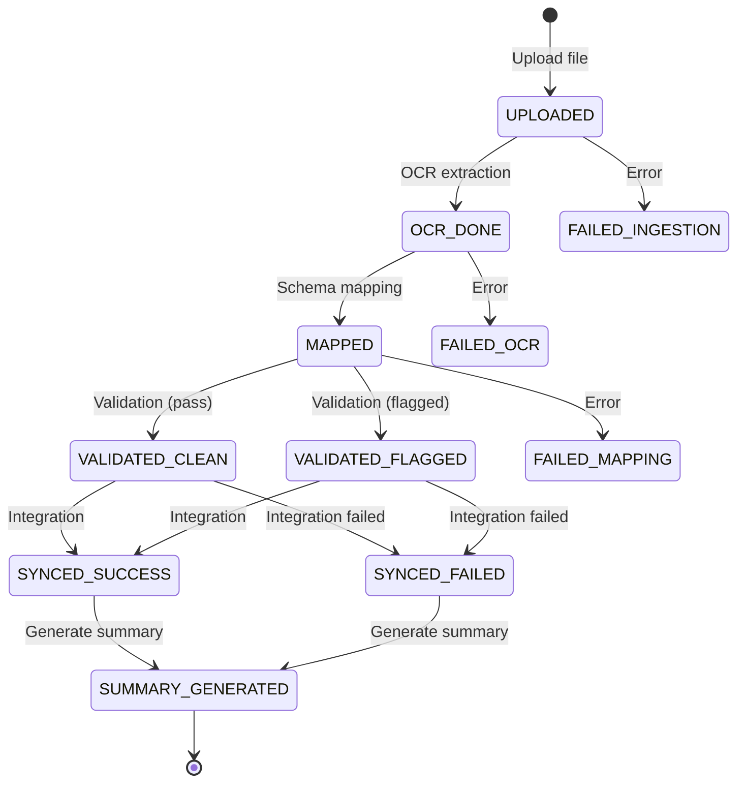
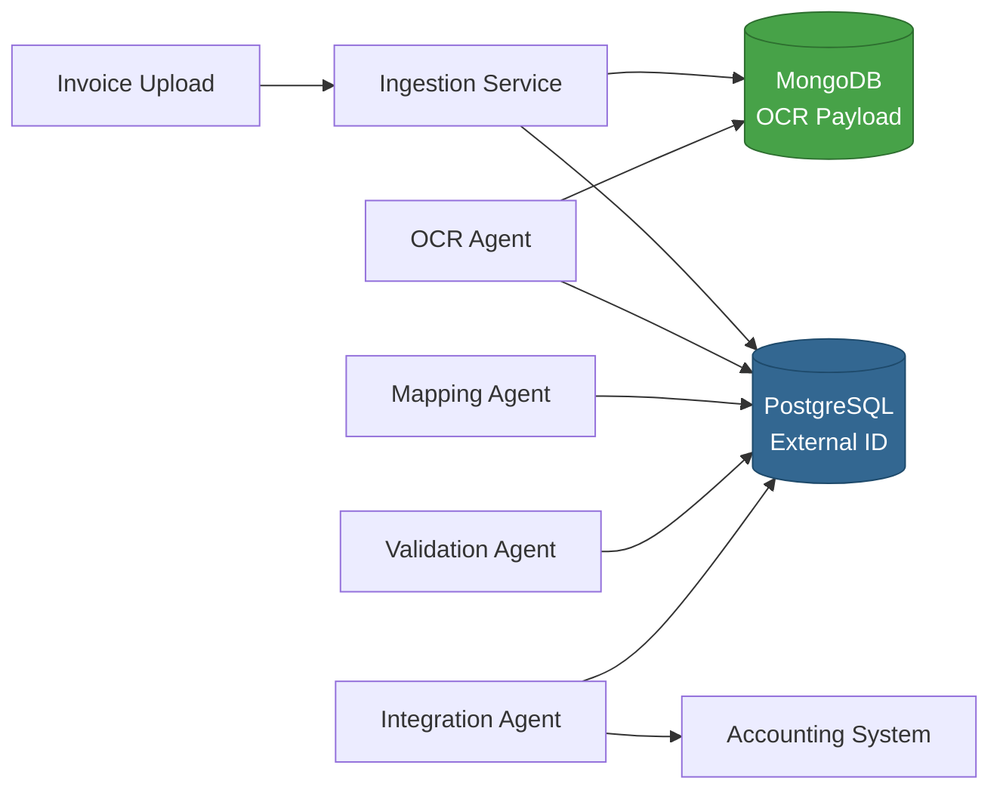

# Architecture Documentation

## 1. High-Level Overview

The **InvoiceCoreProcessor** is a multi-agent, AI-powered microservice that orchestrates the complete invoice processing pipeline. It uses a combination of FastAPI, LangGraph, and the Model Context Protocol (MCP) to process invoices from upload to accounting system integration.

### 1.1 System Architecture

```mermaid

```

### 1.2 Core Components

**FastAPI Application:**
- REST API endpoints for invoice operations
- Request/response handling
- Error handling and validation
- OpenAPI/Swagger documentation

**LangGraph Orchestrator:**
- State machine for workflow management
- Conditional routing based on state
- Error handling and recovery
- State persistence

**Agent Network:**
- Specialized agents for specific tasks
- MCP-based communication protocol
- Dynamic agent discovery via A2A registry
- Tool-based capability exposure

**Data Layer:**
- PostgreSQL for structured, transactional data
- MongoDB for unstructured, document-based data
- Connection pooling and management

---

## 2. Communication Flow

### 2.1 Request Flow

**Step-by-Step Process:**

1. **External Request**
   - Client sends HTTP POST to `/invoice/upload` or gRPC call to `IngestFile`
   - Request includes: `user_id`, `file_path`, `target_system`

2. **API Layer Processing**
   - FastAPI validates request body
   - Creates initial workflow state
   - Invokes LangGraph orchestrator

3. **Workflow Orchestration**
   - LangGraph creates workflow graph instance
   - Sets initial state: `{"status": "UPLOADED", ...}`
   - Executes workflow nodes sequentially

4. **Agent Discovery**
   - Orchestrator queries A2A registry for required capability
   - Registry returns agent ID and tool definition
   - Orchestrator invokes agent via MCP client

5. **Agent Execution**
   - Agent receives tool invocation request
   - Executes business logic
   - Returns result to orchestrator

6. **State Updates**
   - Orchestrator updates workflow state
   - Saves audit log via DataStore agent
   - Determines next step based on state

7. **Completion**
   - Final state reached (e.g., `SYNCED_SUCCESS`)
   - Response returned to client
   - Workflow state persisted

### 2.2 Detailed Sequence Diagram

```mermaid
sequenceDiagram
    participant Client
    participant FastAPI
    participant LangGraph
    participant A2A
    participant OCRAgent
    participant MapperAgent
    participant ValidatorAgent
    participant IntegratorAgent
    participant DataStore
    participant DB

    Client->>FastAPI: POST /invoice/upload
    FastAPI->>LangGraph: Invoke workflow
    LangGraph->>DataStore: Save audit (START → UPLOADED)
    DataStore->>DB: INSERT workflow_audit
    
    LangGraph->>A2A: Lookup CAPABILITY_OCR
    A2A-->>LangGraph: Return OCR agent + tool
    LangGraph->>OCRAgent: Call ocr/extract_text_cascading
    OCRAgent-->>LangGraph: Return OCR result
    LangGraph->>DataStore: Save audit (UPLOADED → OCR_DONE)
    
    LangGraph->>A2A: Lookup CAPABILITY_MAPPING
    A2A-->>LangGraph: Return Mapper agent + tool
    LangGraph->>MapperAgent: Call map/execute
    MapperAgent-->>LangGraph: Return mapped schema
    LangGraph->>DataStore: Save audit (OCR_DONE → MAPPED)
    
    LangGraph->>A2A: Lookup CAPABILITY_VALIDATION
    A2A-->>LangGraph: Return Validator agent + tool
    LangGraph->>ValidatorAgent: Call validate/run_checks
    ValidatorAgent-->>LangGraph: Return validation results
    LangGraph->>DataStore: Save audit (MAPPED → VALIDATED)
    
    LangGraph->>A2A: Lookup CAPABILITY_INTEGRATION
    A2A-->>LangGraph: Return Integrator agent + tool
    LangGraph->>IntegratorAgent: Call sync/push_to_erp
    IntegratorAgent-->>LangGraph: Return integration status
    LangGraph->>DataStore: Save audit (VALIDATED → SYNCED_SUCCESS)
    
    LangGraph-->>FastAPI: Return final state
    FastAPI-->>Client: Return response
```

---

## 3. A2A and MCP Protocols

### 3.1 A2A (Agent-to-Agent) Protocol

**Purpose:**
- High-level agent orchestration and discovery
- Service registry for agent capabilities
- Agent health monitoring

**Components:**

**Agent Registry Service:**
- Stores agent metadata in PostgreSQL
- Maintains agent heartbeat timestamps
- Provides capability-based lookup

**Agent Registration:**
```python
# Agent registers on startup
agent_card = AgentCard(
    agent_id="com.invoice.ocr",
    description="OCR extraction agent",
    tools=[
        ToolDefinition(
            tool_id="ocr/extract_text_cascading",
            capability="CAPABILITY_OCR",
            description="Extract text from invoice files",
            parameters={...}
        )
    ]
)
registry.register_agent(agent_card)
```

**Agent Discovery:**
```python
# Orchestrator discovers agent by capability
agent_id, tool = registry.lookup_agent_by_capability("CAPABILITY_OCR")
# Returns: ("com.invoice.ocr", ToolDefinition(...))
```

**Heartbeat Mechanism:**
- Agents update `last_heartbeat` timestamp on registration
- Stale agents (no heartbeat > 5 minutes) considered unavailable
- Registry automatically cleans up stale entries

### 3.2 MCP (Model Context Protocol)

**Purpose:**
- Standardized tool invocation between agents
- Type-safe communication
- Consistent error handling

**Tool Invocation:**
```python
# MCP client calls agent tool
result = mcp_client.call_tool(
    agent_id="com.invoice.ocr",
    tool_id="ocr/extract_text_cascading",
    invoice_id="inv-123",
    file_path="/path/to/invoice.pdf",
    file_extension="pdf",
    user_id="user-456"
)
```

**Tool Response:**
```python
{
    "status": "OCR_DONE",
    "avg_confidence": 0.95,
    "pages": [
        {"page_number": 1, "text": "Extracted text..."}
    ],
    "tables": [],
    "raw_engine_trace": {"engine": "typhoon"}
}
```

**Error Handling:**
- Tool failures return error status
- Orchestrator handles errors and routes to error handler
- Errors logged with correlation IDs

---

## 4. Agent Registry

### 4.1 Registry Architecture

**Database Schema:**
- `agent_registry`: Agent metadata and heartbeat
- `agent_tools`: Tool definitions and capabilities

**Registry Operations:**

**Registration:**
1. Agent creates `AgentCard` with tools
2. Calls `register_agent(agent_card)`
3. Registry stores agent in `agent_registry` table
4. Registry stores each tool in `agent_tools` table
5. Updates `last_heartbeat` timestamp

**Lookup:**
1. Orchestrator calls `lookup_agent_by_capability(capability)`
2. Registry queries `agent_tools` table
3. Returns first matching agent and tool
4. Returns `None` if no agent found

**Health Monitoring:**
- Agents update heartbeat on registration
- Stale agents filtered out during lookup
- Automatic cleanup of inactive agents

### 4.2 Capability Model

**Capability Types:**
- `CAPABILITY_OCR`: Text extraction from files
- `CAPABILITY_MAPPING`: Schema transformation
- `CAPABILITY_VALIDATION`: Business rule validation
- `CAPABILITY_INTEGRATION`: Accounting system posting
- `CAPABILITY_DB_WRITE`: Database write operations
- `CAPABILITY_METRICS`: Metrics collection
- `CAPABILITY_SUMMARY`: Summary generation

**Capability Matching:**
- Exact match required
- First matching agent returned
- Multiple agents can have same capability (load balancing planned)

---

## 5. Workflow Orchestration

### 5.1 LangGraph State Machine

**State Definition:**
```python
class InvoiceGraphState(TypedDict):
    user_id: str
    file_path: str
    target_system: TargetSystem
    status: Status
    invoice_id: Optional[str]
    extracted_text: Optional[str]
    mapped_schema: Optional[Dict]
    validation_flags: List[str]
    validation_results: List[Dict]
    reliability_score: Optional[float]
    integration_status: Optional[str]
    summary: Optional[Dict]
```

**Workflow Nodes:**
1. **ingestion**: File upload and metadata creation
2. **ocr**: Text extraction via OCR
3. **mapping**: Schema transformation via LLM
4. **validation**: Business rule validation
5. **integration**: Posting to accounting system
6. **summary**: Generate processing summary
7. **error_handler**: Handle errors and failures

**State Transitions:**


### 5.2 Conditional Routing

**Decision Logic:**
```python
def decide_next_step(state: InvoiceGraphState) -> str:
    if 'FAILED' in state['status']:
        return "error_handler"
    
    status_map = {
        'UPLOADED': 'ocr',
        'OCR_DONE': 'mapping',
        'MAPPED': 'validation',
        'VALIDATED_CLEAN': 'integration',
        'VALIDATED_FLAGGED': 'integration',
        'SYNCED_SUCCESS': 'summary',
        'SYNCED_FAILED': 'summary'
    }
    return status_map.get(state['status'], END)
```

**Error Handling:**
- Any node can return error status
- Error handler node logs error and updates state
- Workflow terminates with error status

---

## 6. Data Flow

### 6.1 Data Storage Strategy

**PostgreSQL (Structured Data):**
- Normalized relational data
- ACID transactions
- Foreign key constraints
- Used for: invoices, vendors, customers, validation results, audit logs

**MongoDB (Unstructured Data):**
- Document-based storage
- Flexible schema
- High write throughput
- Used for: OCR payloads, metadata, logs, raw extraction data

### 6.2 Data Flow Diagram



---

## 7. Error Handling & Recovery

### 7.1 Error Types

**Transient Errors:**
- Network timeouts
- Service unavailability
- Rate limiting
- **Recovery**: Retry with exponential backoff

**Permanent Errors:**
- Invalid file format
- Validation failures
- Authentication errors
- **Recovery**: Return error to client, log for review

### 7.2 Error Handling Flow

1. **Error Detection**
   - Agent returns error status
   - Exception caught in workflow node

2. **Error Classification**
   - Transient vs permanent
   - Error code assignment

3. **Error Response**
   - Update workflow state with error
   - Log error with correlation ID
   - Route to error handler node

4. **Error Recovery**
   - Retry for transient errors
   - Manual review for permanent errors

---

## 8. Scalability Considerations

### 8.1 Current Architecture

**Monolithic Deployment:**
- All services in single process
- Shared database connections
- Synchronous processing

**Limitations:**
- Single point of failure
- Limited horizontal scaling
- Database connection pool bottleneck

### 8.2 Future Architecture

**Microservices Separation:**
- Each agent as independent service
- Service-to-service communication via gRPC
- Independent scaling

**Async Processing:**
- Message queue (Kafka/RabbitMQ)
- Background job processing
- Event-driven architecture

**Caching:**
- Redis for agent registry cache
- Response caching for metrics
- Vendor/customer lookup cache

---

## 9. Security Architecture

### 9.1 Current State

- No authentication (development phase)
- All endpoints publicly accessible

### 9.2 Planned Security

**Authentication:**
- JWT tokens
- OAuth 2.0 for external systems
- API keys for service-to-service

**Authorization:**
- Role-based access control (RBAC)
- Scope-based permissions
- Resource-level access control

**Network Security:**
- HTTPS/TLS for all communications
- mTLS for service-to-service
- Network segmentation

---

## 10. Monitoring & Observability

### 10.1 Logging

- Structured logging with correlation IDs
- Log levels: DEBUG, INFO, WARNING, ERROR, CRITICAL
- Log files: `app.log`, `error.log`

### 10.2 Metrics

- Processing time per stage
- Success/failure rates
- Agent availability
- Database connection pool usage

### 10.3 Tracing

- Distributed tracing (planned: OpenTelemetry)
- Request correlation IDs
- Span tracking across agents

---

**Document Version**: 1.0.0  
**Last Updated**: 2024
