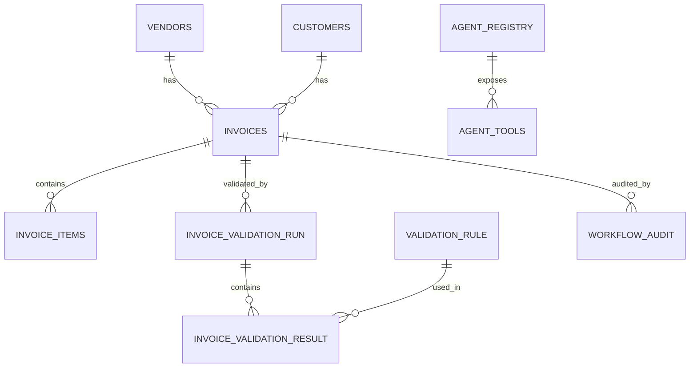

# Database Schema Documentation

## 1. Overview

The InvoiceCoreProcessor uses a **dual-database architecture**:
- **PostgreSQL**: Stores structured, transactional data with ACID guarantees
- **MongoDB**: Stores unstructured, document-based data with flexible schemas

This separation allows for:
- Optimized storage for different data types
- Independent scaling
- Appropriate consistency models

---

## 2. PostgreSQL Schema

### 2.1 Database Design Principles

**Normalization:**
- Third normal form (3NF) for core entities
- Separate master tables for vendors and customers
- Normalized invoice line items

**Data Integrity:**
- Foreign key constraints
- Unique constraints for business rules
- Check constraints for data validation
- NOT NULL constraints for required fields

**Performance:**
- UUID primary keys for distributed systems
- Indexes on foreign keys and frequently queried fields
- Timestamp fields for audit and analytics

### 2.2 Core Tables

#### 2.2.1 Agent Registry Tables

**`agent_registry`**
Stores metadata about agents in the network.

```sql
CREATE TABLE agent_registry (
    id SERIAL PRIMARY KEY,
    agent_id TEXT NOT NULL UNIQUE,
    agent_card JSONB NOT NULL,
    last_heartbeat TIMESTAMPTZ NOT NULL DEFAULT NOW()
);
```

**Fields:**
- `id`: Auto-incrementing primary key
- `agent_id`: Unique identifier (e.g., `com.invoice.ocr`)
- `agent_card`: Complete agent definition in JSONB format
- `last_heartbeat`: Timestamp of last registration/heartbeat

**Indexes:**
- `UNIQUE (agent_id)` - Ensures agent uniqueness

**Usage:**
- Agent discovery and health monitoring
- Stores complete agent metadata for reference

---

**`agent_tools`**
Stores individual tool definitions for each agent.

```sql
CREATE TABLE agent_tools (
    id SERIAL PRIMARY KEY,
    agent_id TEXT NOT NULL REFERENCES agent_registry(agent_id) ON DELETE CASCADE,
    tool_id TEXT NOT NULL,
    capability TEXT NOT NULL,
    description TEXT NOT NULL,
    parameters JSONB,
    UNIQUE (agent_id, tool_id)
);
```

**Fields:**
- `id`: Auto-incrementing primary key
- `agent_id`: Foreign key to `agent_registry`
- `tool_id`: Unique tool identifier within agent (e.g., `ocr/extract_text_cascading`)
- `capability`: Capability type (e.g., `CAPABILITY_OCR`)
- `description`: Human-readable tool description
- `parameters`: JSONB schema for tool parameters

**Indexes:**
- `UNIQUE (agent_id, tool_id)` - Ensures tool uniqueness per agent
- Index on `capability` for fast capability-based lookups

**Usage:**
- Capability-based agent discovery
- Tool metadata for API documentation

---

#### 2.2.2 Master Data Tables

**`vendors`**
Master table for vendor/supplier information.

```sql
CREATE TABLE vendors (
    id           UUID PRIMARY KEY,
    name         TEXT NOT NULL,
    gstin        TEXT,
    pan          TEXT,
    address      TEXT,
    created_at   TIMESTAMPTZ NOT NULL DEFAULT NOW(),
    updated_at   TIMESTAMPTZ NOT NULL DEFAULT NOW(),
    UNIQUE (name, gstin)
);
```

**Fields:**
- `id`: UUID primary key
- `name`: Vendor name (required)
- `gstin`: GST Identification Number (India)
- `pan`: Permanent Account Number (India)
- `address`: Vendor address
- `created_at`: Record creation timestamp
- `updated_at`: Last update timestamp

**Constraints:**
- `UNIQUE (name, gstin)` - Prevents duplicate vendors

**Usage:**
- Vendor master data
- Referenced by invoices
- Deduplication during invoice processing

---

**`customers`**
Master table for customer information.

```sql
CREATE TABLE customers (
    id           UUID PRIMARY KEY,
    name         TEXT NOT NULL,
    gstin        TEXT,
    address      TEXT,
    created_at   TIMESTAMPTZ NOT NULL DEFAULT NOW(),
    updated_at   TIMESTAMPTZ NOT NULL DEFAULT NOW()
);
```

**Fields:**
- `id`: UUID primary key
- `name`: Customer name (required)
- `gstin`: GST Identification Number
- `address`: Customer address
- `created_at`: Record creation timestamp
- `updated_at`: Last update timestamp

**Usage:**
- Customer master data
- Referenced by invoices
- Reporting and analytics

---

#### 2.2.3 Invoice Tables

**`invoices`**
Core table for invoice records.

```sql
CREATE TABLE invoices (
    id               UUID PRIMARY KEY,
    user_id          TEXT NOT NULL,
    vendor_id        UUID REFERENCES vendors(id),
    customer_id      UUID REFERENCES customers(id),

    invoice_no       TEXT NOT NULL,
    invoice_date     DATE NOT NULL,
    due_date         DATE,

    subtotal         NUMERIC(18, 2) NOT NULL,
    gst_amount       NUMERIC(18, 2),
    total_amount     NUMERIC(18, 2),
    round_off        NUMERIC(18, 2),
    grand_total      NUMERIC(18, 2) NOT NULL,

    payment_mode     TEXT,
    payment_reference TEXT,
    payment_status   TEXT,

    upload_timestamp        TIMESTAMPTZ NOT NULL DEFAULT NOW(),
    extraction_confidence   NUMERIC(5, 4),
    status           TEXT NOT NULL DEFAULT 'PENDING',

    -- Metrics fields
    processing_start_time   TIMESTAMPTZ,
    processing_end_time     TIMESTAMPTZ,
    processing_duration_ms  INTEGER,

    created_at       TIMESTAMPTZ NOT NULL DEFAULT NOW(),
    updated_at       TIMESTAMPTZ NOT NULL DEFAULT NOW(),

    UNIQUE (vendor_id, invoice_no, invoice_date)
);
```

**Fields:**

**Identifiers:**
- `id`: UUID primary key
- `user_id`: User who uploaded the invoice
- `vendor_id`: Foreign key to `vendors` table
- `customer_id`: Foreign key to `customers` table

**Invoice Details:**
- `invoice_no`: Invoice number from vendor
- `invoice_date`: Invoice date
- `due_date`: Payment due date

**Financial Fields:**
- `subtotal`: Subtotal before tax
- `gst_amount`: GST/tax amount
- `total_amount`: Total after tax
- `round_off`: Round-off amount
- `grand_total`: Final total amount

**Payment Information:**
- `payment_mode`: Payment method (e.g., "Bank Transfer", "Cash")
- `payment_reference`: Payment reference number
- `payment_status`: Payment status (e.g., "Pending", "Paid")

**Processing Metadata:**
- `upload_timestamp`: When invoice was uploaded
- `extraction_confidence`: OCR/extraction confidence (0-1)
- `status`: Processing status (e.g., "PENDING", "SYNCED_SUCCESS")
- `processing_start_time`: When processing started
- `processing_end_time`: When processing completed
- `processing_duration_ms`: Total processing time in milliseconds

**Timestamps:**
- `created_at`: Record creation timestamp
- `updated_at`: Last update timestamp

**Constraints:**
- `UNIQUE (vendor_id, invoice_no, invoice_date)` - Prevents duplicate invoices

**Indexes:**
- Index on `user_id` for user-based queries
- Index on `status` for status-based filtering
- Index on `invoice_date` for date range queries
- Index on `vendor_id` for vendor-based queries

**Status Values:**
- `PENDING`: Initial state
- `UPLOADED`: File ingested
- `OCR_DONE`: OCR completed
- `MAPPED`: Schema mapping completed
- `VALIDATED_CLEAN`: Validation passed
- `VALIDATED_FLAGGED`: Validation flagged issues
- `SYNCED_SUCCESS`: Posted to accounting system
- `SYNCED_FAILED`: Posting failed
- `FAILED_INGESTION`: Ingestion failed
- `FAILED_OCR`: OCR failed
- `FAILED_MAPPING`: Mapping failed
- `FAILED_SYNC`: Integration failed

---

**`invoice_items`**
Line items for each invoice.

```sql
CREATE TABLE invoice_items (
    id              UUID PRIMARY KEY,
    invoice_id      UUID NOT NULL REFERENCES invoices(id) ON DELETE CASCADE,
    line_no         INTEGER NOT NULL,
    description     TEXT NOT NULL,
    quantity        NUMERIC(18, 4) NOT NULL,
    unit_price      NUMERIC(18, 4) NOT NULL,
    tax_pct         NUMERIC(5, 2),
    amount          NUMERIC(18, 2) NOT NULL,
    hsn             TEXT,
    created_at      TIMESTAMPTZ NOT NULL DEFAULT NOW()
);
```

**Fields:**
- `id`: UUID primary key
- `invoice_id`: Foreign key to `invoices` table
- `line_no`: Line item number (1, 2, 3, ...)
- `description`: Item description
- `quantity`: Item quantity (supports decimals)
- `unit_price`: Price per unit
- `tax_pct`: Tax percentage (e.g., 18.00 for 18%)
- `amount`: Line total (quantity × unit_price)
- `hsn`: HSN (Harmonized System of Nomenclature) code
- `created_at`: Record creation timestamp

**Constraints:**
- `ON DELETE CASCADE`: Line items deleted when invoice deleted

**Indexes:**
- Index on `invoice_id` for fast invoice lookups

**Usage:**
- Stores individual line items for each invoice
- Used for validation (sum of line items = subtotal)
- Required for accounting system integration

---

#### 2.2.4 Validation Tables

**`validation_rule`**
Master table for validation rules.

```sql
CREATE TABLE validation_rule (
    id SERIAL PRIMARY KEY,
    rule_id TEXT NOT NULL UNIQUE,
    category TEXT NOT NULL,
    description TEXT NOT NULL,
    severity SMALLINT NOT NULL CHECK (severity BETWEEN 1 AND 5),
    is_active BOOLEAN NOT NULL DEFAULT TRUE
);
```

**Fields:**
- `id`: Auto-incrementing primary key
- `rule_id`: Unique rule identifier (e.g., `TTL-001`, `LIT-004`)
- `category`: Rule category (e.g., `TOTALS`, `LINE_ITEMS`, `DUPLICATE`)
- `description`: Human-readable rule description
- `severity`: Severity level (1=low, 5=critical)
- `is_active`: Whether rule is currently active

**Rule Categories:**
- `TOTALS`: Total amount validations
- `LINE_ITEMS`: Line item validations
- `DUPLICATE`: Duplicate detection
- `ANOMALY`: Anomaly detection
- `DATES`: Date validations
- `REQUIRED_FIELDS`: Required field checks

**Usage:**
- Master list of all validation rules
- Rule configuration and management
- Rule versioning (via `is_active` flag)

---

**`invoice_validation_run`**
Records each validation execution.

```sql
CREATE TABLE invoice_validation_run (
    id UUID PRIMARY KEY,
    invoice_id UUID NOT NULL REFERENCES invoices(id) ON DELETE CASCADE,
    run_at TIMESTAMPTZ NOT NULL DEFAULT NOW(),
    engine_version TEXT NOT NULL,
    overall_score NUMERIC(5,2),
    status TEXT NOT NULL
);
```

**Fields:**
- `id`: UUID primary key
- `invoice_id`: Foreign key to `invoices` table
- `run_at`: When validation was executed
- `engine_version`: Validation engine version (e.g., `1.0.0`)
- `overall_score`: Reliability score (0-100)
- `status`: Validation status (`VALIDATED_CLEAN`, `VALIDATED_FLAGGED`, `VALIDATION_FAILED`)

**Constraints:**
- `ON DELETE CASCADE`: Validation runs deleted when invoice deleted

**Indexes:**
- Index on `invoice_id` for invoice lookups
- Index on `run_at` for time-based queries

**Usage:**
- Audit trail of validation executions
- Version tracking for validation engine
- Historical validation scores

---

**`invoice_validation_result`**
Individual rule results for each validation run.

```sql
CREATE TABLE invoice_validation_result (
    id BIGSERIAL PRIMARY KEY,
    validation_run_id UUID NOT NULL REFERENCES invoice_validation_run(id) ON DELETE CASCADE,
    rule_id TEXT NOT NULL REFERENCES validation_rule(rule_id),
    status TEXT NOT NULL CHECK (status IN ('PASS','FAIL','WARN')),
    message TEXT,
    severity SMALLINT NOT NULL,
    deduction_points NUMERIC(5,2) NOT NULL DEFAULT 0
);
```

**Fields:**
- `id`: Auto-incrementing primary key
- `validation_run_id`: Foreign key to `invoice_validation_run` table
- `rule_id`: Foreign key to `validation_rule` table
- `status`: Rule result (`PASS`, `FAIL`, `WARN`)
- `message`: Human-readable result message
- `severity`: Rule severity (1-5)
- `deduction_points`: Points deducted from reliability score

**Constraints:**
- `CHECK (status IN ('PASS','FAIL','WARN'))` - Validates status values
- `ON DELETE CASCADE`: Results deleted when validation run deleted

**Indexes:**
- Index on `validation_run_id` for run lookups
- Index on `rule_id` for rule-based queries
- Index on `status` for filtering by result

**Usage:**
- Detailed validation results
- Rule-level audit trail
- Reliability score calculation

---

#### 2.2.5 Audit Tables

**`workflow_audit`**
Immutable audit log of all workflow state transitions.

```sql
CREATE TABLE workflow_audit (
    id BIGSERIAL PRIMARY KEY,
    invoice_id UUID NOT NULL,
    from_status TEXT NOT NULL,
    to_status TEXT NOT NULL,
    timestamp TIMESTAMPTZ NOT NULL DEFAULT NOW(),
    meta JSONB
);
```

**Fields:**
- `id`: Auto-incrementing primary key
- `invoice_id`: Invoice identifier (no foreign key for audit integrity)
- `from_status`: Previous workflow status
- `to_status`: New workflow status
- `timestamp`: When transition occurred
- `meta`: Additional metadata (JSONB) - user, error details, etc.

**Indexes:**
- Index on `invoice_id` for invoice history queries
- Index on `timestamp` for time-based queries
- Index on `to_status` for status-based queries

**Usage:**
- Complete audit trail of invoice processing
- Debugging and troubleshooting
- Compliance and reporting
- Workflow analytics

**Example Meta Field:**
```json
{
  "user_id": "user-123",
  "error": "OCR service timeout",
  "retry_count": 2,
  "agent_id": "com.invoice.ocr"
}
```

---

### 2.3 Database Relationships



---

## 3. MongoDB Schema

### 3.1 Database Design Principles

**Document-Based Storage:**
- Flexible schema for varying data structures
- Nested documents for complex data
- Arrays for lists and collections

**Collections:**
- `invoice_metadata`: Invoice ingestion metadata
- `ocr_payloads`: Raw OCR extraction data
- `agent_logs`: Agent execution logs
- `validation_documents`: Document-based validation views

### 3.2 Collections

#### 3.2.1 `invoice_metadata`

Stores metadata about ingested invoices.

**Document Structure:**
```json
{
  "_id": ObjectId("..."),
  "invoice_id": "inv-abc123-def456",
  "user_id": "user-123",
  "file_path": "/uploads/invoice.pdf",
  "file_size": 245678,
  "file_type": "pdf",
  "upload_timestamp": ISODate("2025-01-15T10:00:00Z"),
  "storage_path": "/storage/invoices/inv-abc123.pdf",
  "ingestion_status": "SUCCESS",
  "metadata": {
    "page_count": 2,
    "has_images": true,
    "extraction_method": "pdfplumber"
  }
}
```

**Fields:**
- `_id`: MongoDB ObjectId
- `invoice_id`: Reference to PostgreSQL invoice
- `user_id`: User who uploaded
- `file_path`: Original file path
- `file_size`: File size in bytes
- `file_type`: File extension
- `upload_timestamp`: Upload time
- `storage_path`: Final storage location
- `ingestion_status`: Ingestion result
- `metadata`: Additional file metadata

**Indexes:**
- Index on `invoice_id` for lookups
- Index on `user_id` for user queries
- Index on `upload_timestamp` for time-based queries

---

#### 3.2.2 `ocr_payloads`

Stores raw OCR extraction results.

**Document Structure:**
```json
{
  "_id": ObjectId("..."),
  "invoice_id": "inv-abc123-def456",
  "ocr_engine": "typhoon",
  "confidence": 0.95,
  "extracted_at": ISODate("2025-01-15T10:00:15Z"),
  "pages": [
    {
      "page_number": 1,
      "text": "Invoice Number: INV-1002\n...",
      "confidence": 0.96
    }
  ],
  "tables": [
    {
      "page_number": 1,
      "cells": [
        ["Description", "Quantity", "Price"],
        ["Service Fee", "1", "5000"]
      ]
    }
  ],
  "raw_response": {
    "engine_trace": {...},
    "processing_time_ms": 1250
  }
}
```

**Fields:**
- `_id`: MongoDB ObjectId
- `invoice_id`: Reference to PostgreSQL invoice
- `ocr_engine`: OCR engine used (typhoon, tesseract, easyocr)
- `confidence`: Average confidence score
- `extracted_at`: When OCR was performed
- `pages`: Array of page extraction results
- `tables`: Array of extracted tables
- `raw_response`: Complete OCR engine response

**Indexes:**
- Index on `invoice_id` for lookups
- Index on `ocr_engine` for engine-based queries
- Index on `extracted_at` for time-based queries

---

#### 3.2.3 `agent_logs`

Stores agent execution logs.

**Document Structure:**
```json
{
  "_id": ObjectId("..."),
  "invoice_id": "inv-abc123-def456",
  "agent_id": "com.invoice.ocr",
  "tool_id": "ocr/extract_text_cascading",
  "executed_at": ISODate("2025-01-15T10:00:15Z"),
  "execution_time_ms": 1250,
  "status": "SUCCESS",
  "input": {
    "file_path": "/uploads/invoice.pdf",
    "file_extension": "pdf"
  },
  "output": {
    "status": "OCR_DONE",
    "avg_confidence": 0.95
  },
  "error": null
}
```

**Fields:**
- `_id`: MongoDB ObjectId
- `invoice_id`: Reference to invoice
- `agent_id`: Agent identifier
- `tool_id`: Tool identifier
- `executed_at`: Execution timestamp
- `execution_time_ms`: Execution duration
- `status`: Execution status
- `input`: Tool input parameters
- `output`: Tool output result
- `error`: Error details (if failed)

**Indexes:**
- Index on `invoice_id` for invoice history
- Index on `agent_id` for agent-based queries
- Index on `executed_at` for time-based queries
- Compound index on `(invoice_id, executed_at)` for chronological queries

---

#### 3.2.4 `validation_documents`

Document-based view of validation runs (denormalized for reporting).

**Document Structure:**
```json
{
  "_id": ObjectId("..."),
  "invoice_id": "inv-abc123-def456",
  "validation_run_id": "val-run-789",
  "run_at": ISODate("2025-01-15T10:00:45Z"),
  "overall_score": 75.5,
  "status": "VALIDATED_FLAGGED",
  "rules": [
    {
      "rule_id": "TTL-001",
      "category": "TOTALS",
      "status": "FAIL",
      "message": "Subtotal mismatch",
      "severity": 5,
      "deduction_points": 20.0
    }
  ],
  "summary": {
    "total_rules": 5,
    "passed": 3,
    "failed": 1,
    "warnings": 1
  }
}
```

**Fields:**
- `_id`: MongoDB ObjectId
- `invoice_id`: Reference to invoice
- `validation_run_id`: Reference to PostgreSQL validation run
- `run_at`: Validation execution time
- `overall_score`: Reliability score
- `status`: Validation status
- `rules`: Array of rule results
- `summary`: Summary statistics

**Usage:**
- Fast reporting queries
- Analytics and dashboards
- Denormalized view for performance

---

## 4. Data Migration & Maintenance

### 4.1 Schema Migrations

**Current Approach:**
- SQL scripts in `src/invoice_core_processor/database/schema.sql`
- Manual application via `psql`

**Future Approach:**
- Alembic for versioned migrations
- Automated migration on deployment

### 4.2 Data Retention

**PostgreSQL:**
- Active invoices: 2 years
- Archived invoices: 5 years
- Audit logs: 7 years (immutable)

**MongoDB:**
- OCR payloads: 1 year
- Agent logs: 90 days
- Validation documents: 2 years

### 4.3 Backup Strategy

**PostgreSQL:**
- Daily full backups
- Continuous WAL archiving
- Point-in-time recovery

**MongoDB:**
- Daily snapshots
- Oplog replication
- Sharded cluster backups

---

## 5. Performance Optimization

### 5.1 Indexes

**PostgreSQL Indexes:**
- Foreign key indexes
- Status-based indexes
- Date range indexes
- Composite indexes for common queries

**MongoDB Indexes:**
- `invoice_id` indexes on all collections
- Time-based indexes for time-series queries
- Compound indexes for multi-field queries

### 5.2 Query Optimization

**PostgreSQL:**
- Use EXPLAIN ANALYZE for query planning
- Avoid N+1 queries with JOINs
- Use prepared statements for repeated queries

**MongoDB:**
- Use projection to limit fields
- Use aggregation pipeline for complex queries
- Index hints for query optimization

---

**Document Version**: 1.0.0  
**Last Updated**: 2024
